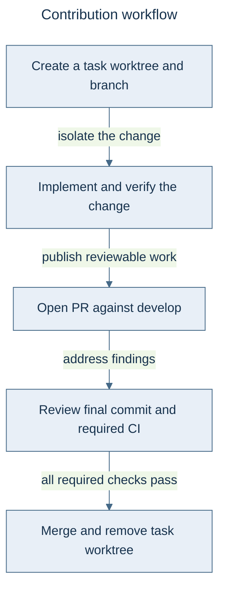

# Contributing to Victor

Contributions are welcome: bug fixes, tests, documentation, tools, providers and
contract-first domain packages. Read the [architecture](docs/architecture.md)
before changing a boundary, and keep each PR focused on one reviewable change.

## Contribution Workflow



---

## Quick Start

```bash
# 1. Fork and clone
git clone https://github.com/YOUR_USERNAME/victor.git
cd victor

# 2. Create a worktree from develop
git fetch origin
git worktree add ../victor-your-feature -b feature/your-feature-name origin/develop
cd ../victor-your-feature

# 3. Install from this worktree so editable imports use the code being changed
python -m venv .venv
source .venv/bin/activate  # Windows: .venv\Scripts\activate
make install-dev   # installs victor-contracts (in-repo SDK) before victor-ai[dev]
# without make: pip install -e ./victor-contracts -e ".[dev]"

# 4. Make changes and test
make test
make lint

# 5. Commit and push
git add .
git commit -m "feat: add your feature"
git push origin feature/your-feature-name

# 6. Create pull request
gh pr create --base develop --head feature/your-feature-name
```

**IMPORTANT**: Victor uses a strict PR-based workflow with CI/CD validation. All changes must go through pull requests, and required status checks must pass before merging to `develop`. Releases use a separate `develop` → `main` promotion.

For detailed information about the PR workflow, branch structure, and release process, see [PR Workflow Guide](docs/development/PR_WORKFLOW.md).

---

## Types of Contributions

### Bug Reports

Search [existing issues](https://github.com/anvai-labs/victor/issues) first. Include
reproduction steps, expected and actual behavior, installed version, platform and
provider/model. Remove credentials from logs. Report security issues through
[SECURITY.md](SECURITY.md).

### Feature Requests

Use [Discussions](https://github.com/anvai-labs/victor/discussions) to describe the
problem, intended users and alternatives. Domain-specific behavior usually belongs
in a vertical; changes to framework contracts require the proposal process below.

### Framework-Level Changes (FEP Process)

Use a Framework Enhancement Proposal for public API changes, new architectural
boundaries, workflow DSL changes, deprecations or other cross-cutting behavior.
Routine bug fixes, documentation and vertical-internal changes do not need a new FEP.

The canonical process is [FEP Process](docs/FEP_PROCESS.md); [feps/README.md](feps/README.md)
indexes the current proposal files and their actual statuses. Preserve historical
proposal context and clearly distinguish a design target from implemented code.

### Vertical Contributions

New verticals use a contract-first external package: depend on `victor-contracts`,
declare capabilities through `victor_contracts`, and register through the
`victor.plugins` entry point. The Victor runtime discovers the package. Keep
framework and runtime implementation details out of definition-layer imports.

Start with the working [external vertical template](examples/external_vertical/)
or scaffold a package:

```bash
python scripts/scaffold_vertical.py my-vertical --output-dir /path/to/workspace
```

Use the [vertical authoring guide](victor-contracts/VERTICAL_DEVELOPMENT.md) for the
manifest, plugin registration and packaging contract, and the
[contract stability policy](victor-contracts/CONTRACT_STABILITY.md) for compatibility.
The five first-party domain packages live under `verticals/`; other ecosystem packages
are installed separately.

Validate the installed package and run its own tests:

```bash
cd /path/to/workspace/victor-my-vertical
pip install -e .
victor-contracts check victor-my-vertical
pytest tests/
```

For first-party changes, also run `make check-vertical-boundaries` and the affected
vertical's tests. Existing extension allowances do not weaken the contract-only
rule for new definition-layer code.

### Tool Contributions

Use the [custom-tool tutorial](docs/tutorials/build-custom-tool.md) and
[tool API reference](docs/api-reference/tools.md) for the current declaration,
registration and execution contracts. Extend an established tool module when the
operation belongs there; test successful calls, invalid input and failure behavior.
For external plugins, use the `victor_contracts` tool definitions described in the
vertical authoring guide.

### Provider Contributions

Use the [provider integration tutorial](docs/tutorials/integrate-provider.md) and
[provider API reference](docs/api-reference/providers.md). Cover buffered and streaming
responses, tool calls, usage accounting, cancellation and provider errors. Follow the
existing provider registry and capability conventions rather than maintaining a
separate registration path. [SUPPORT.md](SUPPORT.md) describes support tiers.

## Testing Guidelines

The [testing guide](docs/development/testing.md) owns fixture, marker, mocking and
coverage instructions. Tests live primarily in `tests/unit/` and `tests/integration/`;
workflow suites are under each directory's `workflows/` subtree.

Before opening a PR, run targeted behavior tests and the full affected suites.
Include negative tests for failure, cancellation, state ownership or boundary changes.
Run repository collection to catch stale imports, and the required formatting,
linting and typing checks described in the [PR workflow](docs/development/PR_WORKFLOW.md).
Report commands and outcomes in the PR, including environmental limits.

## Code Style

Follow [Code Style](docs/development/code-style.md): Python 3.11+, typed public APIs,
Black formatting, Ruff linting and the repository's mypy checks. Use clear names,
focused functions and Google-style docstrings where documentation is useful.
Public signatures and code examples should agree with the implementation.

## Pull Request Process

1. Create an isolated worktree from `origin/develop` and install editable packages
   from that worktree.
2. Implement the change, update affected docs, and complete the required checks.
3. Open the PR with `gh pr create --base develop`; use a conventional title such as
   `fix:`, `feat:`, `refactor:`, `docs:`, `ci:` or `chore:`.
4. Describe the concrete behavior change, compatibility impact and validation.
   Address review findings in the same PR. Changes involving concurrency, layering
   or shared state require an independent adversarial review.
5. Obtain at least one maintainer approval and merge after required CI passes. Remove the task worktree and branches
   after verifying the merge.

The [PR workflow](docs/development/PR_WORKFLOW.md) is the canonical source for branch,
CI and release conventions. Normal work squash-merges into `develop`; a release
promotion merges `develop` into `main` with a merge commit to preserve ancestry.
Do not rewrite integration-branch history.

## Areas We Need Help With

Useful contributions include reproducible bug reports, provider compatibility tests,
focused runtime extractions, contract-first domain packages and improvements to docs
and examples. Consult the [roadmap](docs/roadmap.md) and open issues for current work;
dated review findings may already have been resolved.

## Questions?

Use [Discussions](https://github.com/anvai-labs/victor/discussions) for design questions
and [Issues](https://github.com/anvai-labs/victor/issues) for actionable defects.
Keep feedback specific and respectful. For installation and runtime support, start
with [SUPPORT.md](SUPPORT.md).

## Additional Resources

- [Published documentation](https://anvai-labs.github.io/victor/)
- [Development setup](docs/development/setup.md)
- [Architecture](docs/architecture.md)
- [FEP index](feps/README.md)
- [Security policy](SECURITY.md)
