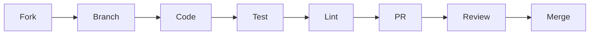

<div align="center">

# Contributing to Victor

</div>

Thank you for your interest in contributing to Victor! We welcome contributions from everyone, whether you're fixing bugs, adding features, improving documentation, or proposing framework enhancements.

## Table of Contents

- [Contribution Workflow](#contribution-workflow)
- [Quick Start](#quick-start)
- [Types of Contributions](#types-of-contributions)
  - [Bug Reports](#bug-reports)
  - [Feature Requests](#feature-requests)
  - [Framework-Level Changes (FEP Process)](#framework-level-changes-fep-process)
  - [Vertical Contributions](#vertical-contributions)
  - [Tool Contributions](#tool-contributions)
  - [Provider Contributions](#provider-contributions)
- [Testing Guidelines](#testing-guidelines)
- [Code Style](#code-style)
- [Pull Request Process](#pull-request-process)
- [Areas We Need Help With](#areas-we-need-help-with)
- [Questions?](#questions)

---

## Contribution Workflow



---

## Quick Start

```bash
# 1. Fork and clone
git clone https://github.com/YOUR_USERNAME/victor.git
cd victor

# 2. Set up environment
python -m venv venv
source venv/bin/activate  # Windows: venv\Scripts\activate
make install-dev   # installs victor-contracts (in-repo SDK) before victor-ai[dev]
# without make: pip install -e ./victor-contracts -e ".[dev]"

# 3. Create branch
git checkout -b feature/your-feature-name

# 4. Make changes and test
make test
make lint

# 5. Commit and push
git add .
git commit -m "feat: add your feature"
git push origin feature/your-feature-name

# 6. Create pull request
# Visit https://github.com/anvai-labs/victor/pulls
```

**IMPORTANT**: Victor uses a strict PR-based workflow with CI/CD validation. All changes must go through pull requests, and all status checks must pass before merging to main.

For detailed information about the PR workflow, branch structure, and release process, see [PR Workflow Guide](docs/development/PR_WORKFLOW.md).

---

## Types of Contributions

Victor accepts several types of contributions. Choose the one that best matches your idea:

### Bug Reports

Found a bug? We'd love to know about it!

**Before creating a bug report:**
- Check [existing issues](https://github.com/anvai-labs/victor/issues) to avoid duplicates
- Verify it's not already fixed in the latest version
- Prepare a minimal reproduction case

**Bug report checklist:**
- [ ] Use a clear title (e.g., "Bug: Tool execution fails with empty input")
- [ ] Describe the expected behavior
- [ ] Describe the actual behavior
- [ ] Provide steps to reproduce
- [ ] Include environment details (OS, Python version, Victor version)
- [ ] Include error messages and stack traces
- [ ] Add relevant logs or screenshots

### Feature Requests

Have an idea for improving Victor?

**Before requesting a feature:**
- Discuss in [GitHub Discussions](https://github.com/anvai-labs/victor/discussions) first
- Check if it fits Victor's scope and roadmap
- Consider if it should be a framework change (needs FEP) or vertical-specific

**Feature request checklist:**
- [ ] Use a clear title (e.g., "Feature: Support for XYZ provider")
- [ ] Describe the problem you're trying to solve
- [ ] Propose a solution
- [ ] Explain why this is useful
- [ ] Consider alternative approaches
- [ ] Identify if this requires a FEP (see [Framework-Level Changes](#framework-level-changes-fep-process))

### Framework-Level Changes (FEP Process)

**Framework Enhancement Proposals (FEPs)** are for significant changes to Victor's core framework, public APIs, or architecture.

#### When to Create a FEP

You need a FEP for:

- ✅ Changes to `victor/framework/` public APIs
- ✅ New protocol definitions or changes to existing protocols
- ✅ Vertical capability promotion to framework
- ✅ Breaking changes to provider or tool interfaces
- ✅ New core architectural patterns (agents, workflows, state management)
- ✅ Deprecation of major framework components
- ✅ Changes to workflow YAML DSL structure
- ✅ Process changes (governance, contribution guidelines)

You do NOT need a FEP for:

- ❌ New verticals (use [Vertical Contributions](#vertical-contributions))
- ❌ New tools (use [Tool Contributions](#tool-contributions))
- ❌ New providers (use [Provider Contributions](#provider-contributions))
- ❌ Bug fixes and performance optimizations
- ❌ Documentation improvements
- ❌ Vertical-internal changes

#### FEP Creation Process

1. **Pre-Discussion**
   ```bash
   # Start with a discussion
   # Visit: https://github.com/anvai-labs/victor/discussions
   ```
   - Discuss your idea informally
   - Check for existing FEPs addressing similar issues
   - Gather preliminary feedback
   - Ensure the change is at the framework level

2. **Create FEP**
   ```bash
   # Use the CLI tool
   victor fep create --title "Your Title" --type standards

   # Or manually copy the template
   cp feps/fep-0000-template.md feps/fep-XXXX-your-title.md
   ```

3. **Validate FEP**
   ```bash
   # Validate before submitting
   victor fep validate feps/fep-XXXX-your-title.md
   ```

4. **Submit FEP**
   - Create a pull request with your FEP file
   - FEP will be assigned a number (replace XXXX)
   - PR will be labeled with `fep` and `status:review`
   - Minimum 14-day review period begins

5. **Participate in Review**
   - Respond to feedback via PR comments
   - Address concerns and update FEP
   - Build consensus with the community

6. **Implementation**
   - Once accepted, status changes to "Accepted"
   - Implementation is assigned to you or a contributor
   - FEP status changes to "Implemented" when merged

#### FEP Types

| Type | Purpose | Examples |
|------|---------|----------|
| **Standards Track** | Framework-level changes affecting public APIs, architecture, or ecosystem | New provider interface, workflow DSL changes, vertical promotion |
| **Informational** | Design guidelines, architectural decisions, best practices | SOLID compliance guidelines, performance standards |
| **Process** | Changes to the FEP process itself | Review timeline modifications, governance changes |

#### FEP Template

All FEPs must include:

1. **Summary** (~200 words) - Executive summary
2. **Motivation** - Problem statement and goals
3. **Proposed Change** - Detailed technical specification
4. **Benefits** - Impact on users, developers, ecosystem
5. **Drawbacks and Alternatives** - Honest assessment
6. **Unresolved Questions** - Open discussion items
7. **Implementation Plan** - Phased approach
8. **Migration Path** - For breaking changes
9. **Compatibility** - Backward compatibility impact
10. **References** - Related issues, discussions, documentation

**For complete details, see [feps/README.md](feps/README.md)**

### Vertical Contributions

Verticals are self-contained domain extensions (Coding, DevOps, RAG, DataAnalysis, Research). You can create new verticals without modifying the core framework.

The supported model for new verticals is a **contract-first external package**: depend only on `victor-contracts`, declare tools/capabilities/prompts through the contract surface, and register via the `victor.plugins` entry point. The `victor-ai` runtime discovers and runs the package; your code never imports `victor.*` internals.

Canonical references:

- [`examples/external_vertical/`](examples/external_vertical/) — a working contract-only package (`victor-security`) you can copy as a starting point
- [`victor-contracts/VERTICAL_DEVELOPMENT.md`](victor-contracts/VERTICAL_DEVELOPMENT.md) — the full authoring guide
- [`victor-contracts/CONTRACT_STABILITY.md`](victor-contracts/CONTRACT_STABILITY.md) — which contract surfaces are stable, and the deprecation policy

#### Creating a New Vertical

Copy `examples/external_vertical/` as a template, or generate a skeleton with the in-repo scaffolder:

```bash
python scripts/scaffold_vertical.py my-vertical --output-dir /path/to/workspace
```

#### Vertical Package Structure

```
victor-security/
├── pyproject.toml                  # Package configuration + entry point
├── victor-vertical.toml            # Vertical metadata manifest
├── README.md                       # Documentation
├── src/
│   └── victor_security/
│       ├── __init__.py             # Exposes the plugin entry point
│       └── assistant.py            # Vertical definition (VerticalBase subclass)
└── tests/
    └── test_assistant.py
```

#### victor-vertical.toml Requirements

Every vertical package must include a `victor-vertical.toml` manifest. The schema is `VerticalPackageMetadata` in `victor/core/verticals/package_schema.py`; the required fields are `name`, `version`, `description`, `authors`, `license`, `requires_victor`, and the `[vertical.class]` table with `module` and `class_name`. Everything else is optional.

```toml
[vertical]
name = "security"                          # Required: lowercase, alphanumeric/underscore
version = "0.1.0"                          # Required: semantic version
description = "Security analysis assistant" # Required: human-readable description
authors = [{name = "Your Name", email = "you@example.com"}]  # Required
license = "Apache-2.0"                     # Required: SPDX identifier
requires_victor = ">=0.5.0"                # Required: minimum Victor version

python_package = "victor-security"         # Optional: PyPI package name
homepage = "https://github.com/user/victor-security"          # Optional
repository = "https://github.com/user/victor-security"        # Optional
documentation = "https://victor-security.readthedocs.io"      # Optional
issues = "https://github.com/user/victor-security/issues"     # Optional

category = "development"                    # Optional: marketplace category
tags = ["security", "analysis", "scanning"] # Optional: search tags

[vertical.class]
module = "victor_security.assistant"           # Required: import path
class_name = "SecurityAssistant"               # Required: class name
provides_tools = ["scan", "analyze"]           # Optional: tool list
provides_workflows = ["security_scan"]         # Optional: workflow list
provides_capabilities = ["security_analysis"]  # Optional: capabilities

[vertical.dependencies]           # Optional
python = ["requests>=2.28.0"]  # Python dependencies
verticals = []                 # Dependencies on other verticals

[vertical.compatibility]          # Optional
requires_tool_calling = true
preferred_providers = ["anthropic", "openai"]
min_context_window = 100000
python_version = ">=3.10"

[vertical.security]               # Optional
signed = false
verified_author = false
permissions = ["network", "filesystem:read"]
```

#### Vertical Registration

Verticals are discovered through the canonical `victor.plugins` entry-point group:

```toml
# In your vertical's pyproject.toml
[project.entry-points."victor.plugins"]
security = "victor_security:plugin"
```

See `examples/external_vertical/pyproject.toml` for a complete working configuration.

#### Validating Your Vertical Locally

Two commands prove a vertical package against the contract before you publish (or open a PR against the first-party verticals):

```bash
# Validate an installed vertical package against the Victor contracts
# (loads its victor.plugins entry points and validates the vertical
# definitions they publish)
victor-contracts check victor-security

# For first-party verticals in this repo: enforce that verticals
# import only victor_contracts, never victor.* runtime internals
make check-vertical-boundaries

# And run the package's own tests
pytest tests/
```

#### Publishing Verticals

```bash
# 1. Build your vertical package
cd victor-security
python -m build

# 2. Upload to PyPI
twine upload dist/*

# 3. Users can now install it
pip install victor-security

# 4. Verify discovery
victor plugin list
```

#### Installing Verticals

Vertical packages are normal Python packages: installing one into the same environment as `victor-ai` is enough for discovery via the `victor.plugins` entry point. The `victor plugin` commands manage local-path/git installs and enablement (the older `victor vertical` command group still works but is deprecated in favor of `victor plugin`):

```bash
# Install from PyPI (with optional version constraint)
pip install "victor-security>=1.0.0"

# Install from a local path or git URL via the plugin manager
victor plugin install ./path/to/victor-security

# List installed plugins and verticals
victor plugin list

# Search for plugins
victor plugin search security

# Uninstall
victor plugin uninstall victor-security
```

### Tool Contributions

Tools are self-contained operations that agents can call. Each tool inherits from `BaseTool` and defines its parameters via JSON Schema.

#### Creating a New Tool

```python
# victor/tools/my_tool.py

from typing import Dict, Any, Optional
from victor.tools.base import BaseTool, CostTier

class MyTool(BaseTool):
    """A tool that does something useful."""

    name: str = "my_tool"
    description: str = "Performs a useful operation"
    parameters: Dict[str, Any] = {
        "type": "object",
        "properties": {
            "input": {
                "type": "string",
                "description": "The input to process",
            },
            "option": {
                "type": "boolean",
                "description": "An optional flag",
                "default": False,
            }
        },
        "required": ["input"],
    }
    cost_tier: CostTier = CostTier.LOW

    async def execute(
        self,
        input: str,
        option: bool = False,
        **kwargs
    ) -> Dict[str, Any]:
        """Execute the tool.

        Args:
            input: The input to process
            option: An optional flag
            **kwargs: Additional parameters

        Returns:
            Tool execution result
        """
        # Your tool logic here
        result = f"Processed: {input}"
        return {"success": True, "result": result}
```

#### Tool Registration

```python
# victor/tools/my_tool/__init__.py

from victor.tools.my_tool import MyTool

# Tools are auto-registered via SharedToolRegistry
def register_tool():
    from victor.tools.registry import SharedToolRegistry
    registry = SharedToolRegistry.get_instance()
    registry.register("my_tool", MyTool)
```

#### Cost Tiers

Tools must declare a cost tier:

| Tier | Description | Examples |
|------|-------------|----------|
| `CostTier.FREE` | No external API calls | File operations, string manipulation |
| `CostTier.LOW` | Minimal external calls | Local computations, fast APIs |
| `CostTier.MEDIUM` | Moderate cost | Code execution, search APIs |
| `CostTier.HIGH` | Expensive operations | LLM calls, long-running tasks |

#### Tool Testing

```python
# tests/unit/tools/test_my_tool.py

import pytest
from victor.tools.my_tool import MyTool

@pytest.mark.asyncio
async def test_my_tool_basic():
    tool = MyTool()
    result = await tool.execute(input="test")

    assert result["success"] is True
    assert "Processed" in result["result"]

@pytest.mark.asyncio
async def test_my_tool_with_option():
    tool = MyTool()
    result = await tool.execute(input="test", option=True)

    assert result["success"] is True
```

#### Tool Documentation

```bash
# Generate tool catalog (update docs)
python scripts/generate_tool_catalog.py
```

### Provider Contributions

Providers enable Victor to work with different LLM services. Each provider inherits from `BaseProvider`.

#### Creating a New Provider

```python
# victor/providers/my_provider.py

from typing import Optional, AsyncIterator, List, Dict, Any
from victor.providers.base import BaseProvider, StreamChunk
from victor.protocols import Message, ToolCall

class MyProvider(BaseProvider):
    """My custom LLM provider."""

    name: str = "my_provider"

    def __init__(
        self,
        api_key: str,
        model: str = "default-model",
        **kwargs
    ):
        super().__init__(api_key=api_key, model=model, **kwargs)
        # Initialize provider-specific clients

    async def chat(
        self,
        messages: List[Message],
        tools: Optional[List[Dict]] = None,
        **kwargs
    ) -> Dict[str, Any]:
        """Execute a chat completion.

        Args:
            messages: Conversation history
            tools: Available tools for the LLM
            **kwargs: Additional parameters

        Returns:
            Response dict with content, tool_calls, usage
        """
        # Your provider logic here
        response = await self._call_api(messages, tools)
        return self._parse_response(response)

    async def stream_chat(
        self,
        messages: List[Message],
        tools: Optional[List[Dict]] = None,
        **kwargs
    ) -> AsyncIterator[StreamChunk]:
        """Stream a chat completion.

        Yields:
            StreamChunk objects with delta content
        """
        # Your streaming logic here
        async for chunk in self._stream_api(messages, tools):
            yield StreamChunk(
                content=chunk.get("content", ""),
                tool_calls=chunk.get("tool_calls"),
                finish_reason=chunk.get("finish_reason"),
            )

    def supports_tools(self) -> bool:
        """Check if provider supports function calling."""
        return True
```

#### Provider Registration

```python
# victor/providers/registry.py

from victor.providers.my_provider import MyProvider

def register_providers():
    # Auto-register via entry point or manual
    ProviderRegistry.register("my_provider", MyProvider)
```

#### Provider Testing

```python
# tests/unit/providers/test_my_provider.py

import pytest
from victor.providers.my_provider import MyProvider

@pytest.mark.asyncio
async def test_provider_chat():
    provider = MyProvider(api_key="test-key")

    messages = [
        {"role": "user", "content": "Hello"}
    ]

    response = await provider.chat(messages)

    assert "content" in response
    assert response["content"]

@pytest.mark.asyncio
async def test_provider_stream_chat():
    provider = MyProvider(api_key="test-key")

    messages = [
        {"role": "user", "content": "Hello"}
    ]

    chunks = []
    async for chunk in provider.stream_chat(messages):
        chunks.append(chunk)

    assert len(chunks) > 0
```

#### Model Capabilities

Update `victor/config/model_capabilities.yaml` to add model-specific support:

```yaml
models:
  "my-model*":
    training:
      tool_calling: true
    providers:
      my_provider:
        native_tool_calls: true
        parallel_tool_calls: true
    settings:
      recommended_tool_budget: 15
```

---

## Testing Guidelines

Victor requires comprehensive testing for all contributions.

### Test Types

| Type | Purpose | Location |
|------|---------|----------|
| **Unit Tests** | Test individual functions/classes | `tests/unit/` |
| **Integration Tests** | Test component interactions | `tests/integration/` |
| **Workflow Tests** | Test workflow execution | `tests/workflows/` |
| **Provider Tests** | Test LLM provider integrations | `tests/unit/providers/` |

### Test Commands

```bash
# Run all unit tests
pytest tests/unit -v

# Run single test
pytest tests/unit/test_X.py::test_name -v

# Run integration tests
pytest tests/integration -v

# Run with coverage
pytest --cov=victor --cov-report=html

# Skip slow tests
pytest -m "not slow" -v

# Run only integration tests
pytest -m integration
```

### Test Fixtures

Victor provides several test fixtures:

```python
import pytest
from victor.testing import reset_singletons, isolate_environment_variables

@pytest.fixture(autouse=True)
def reset_victor_singletons(reset_singletons):
    """Reset singletons between tests."""
    pass

@pytest.fixture(autouse=True)
def isolate_env(isolate_environment_variables):
    """Isolate environment variables."""
    pass

# For orchestrator tests (auto-applies)
def test_orchestrator_feature(auto_mock_docker_for_orchestrator):
    """Test with mocked Docker."""
    # Your test here
    pass
```

### Test Coverage

- **Minimum coverage**: 80% for new code
- **Critical paths**: 90%+ coverage expected
- **Complex logic**: 100% coverage preferred

```bash
# Generate coverage report
pytest --cov=victor --cov-report=html
open htmlcov/index.html  # View report
```

### Test Markers

Use pytest markers to categorize tests:

```python
@pytest.mark.unit
def test_unit_feature():
    """Unit test marker."""
    pass

@pytest.mark.integration
@pytest.mark.slow
async def test_integration_feature():
    """Integration test marker."""
    pass

@pytest.mark.workflows
def test_workflow_execution():
    """Workflow test marker."""
    pass
```

### HTTP Mocking

Use `respx` for HTTP mocking in async tests:

```python
import pytest
import respx

@pytest.mark.asyncio
@respx.mock
async def test_http_call():
    """Test with mocked HTTP."""
    mock_response = {"result": "success"}

    route = respx.post("https://api.example.com/endpoint").mock(
        return_value=httpx.Response(200, json=mock_response)
    )

    # Your test code here
    assert route.called
```

### Docker Mocking

For tests requiring Docker:

```python
from victor.testing.fixtures import mock_code_execution_manager

def test_with_docker_mock(mock_code_execution_manager):
    """Test with mocked Docker execution."""
    # Your test here
    pass
```

---

## Code Style

Victor enforces strict code style standards.

### Style Requirements

| Requirement | Standard | Enforcement |
|-------------|----------|-------------|
| **Type hints** | Required on all public APIs | MyPy |
| **Docstrings** | Google-style format | Manual review |
| **Line length** | 100 characters | Black |
| **I/O operations** | Async/await required | Manual review |
| **HTTP mocking** | Use `respx` | Manual review |

### Formatting Tools

```bash
# Format code
black victor tests

# Lint code
ruff check --fix victor tests

# Type check
mypy victor

# Run all checks
make lint  # Equivalent to: black . && ruff check . && mypy victor
```

### Type Hints

```python
from typing import List, Dict, Optional, AsyncIterator

def process_data(
    input_data: List[str],
    options: Optional[Dict[str, Any]] = None
) -> Dict[str, Any]:
    """Process input data with options.

    Args:
        input_data: List of strings to process
        options: Optional processing configuration

    Returns:
        Processed data dictionary
    """
    # Implementation
    pass
```

### Docstrings

```python
def complex_function(arg1: str, arg2: int) -> bool:
    """One-line summary.

    Longer description explaining what the function does,
    why it exists, and any important details.

    Args:
        arg1: Description of arg1
        arg2: Description of arg2

    Returns:
        Description of return value

    Raises:
        ValueError: If arg1 is invalid
        TypeError: If arg2 is not an integer

    Examples:
        >>> complex_function("test", 42)
        True
    """
    pass
```

---

## Pull Request Process

### Before Creating a PR

1. **Test your changes**
   ```bash
   make test
   make test-cov  # Check coverage
   ```

   **Moving or renaming any symbol?** Sweep every importer of the old name
   repo-wide before pushing — a missed importer breaks test *collection*, which
   turns the entire shard matrix red at develop → main promotion:
   ```bash
   grep -rn "OldName" victor/ victor-contracts/ tests/ verticals/ examples/ scripts/
   pytest tests/ --collect-only -q   # the same gate CI runs on every develop PR
   ```

2. **Format and lint**
   ```bash
   make format
   make lint
   ```

3. **Update documentation**
   - Add/update docstrings
   - Update README.md if needed
   - Add examples for new features
   - Update CHANGELOG.md

### Creating a PR

```bash
# Push your changes
git push origin feature/your-feature-name

# Create PR via GitHub CLI
gh pr create --title "feat: add your feature" --body "Description..."

# Or visit: https://github.com/anvai-labs/victor/pulls
```

### PR Template

Use the provided PR template at `.github/PULL_REQUEST_TEMPLATE.md`:

```markdown
## Description
Brief description of changes

## Type of Change
- [ ] Bug fix
- [ ] New feature
- [ ] Breaking change
- [ ] Documentation update

## Related Issues
Fixes #123

## Changes Made
- Change 1
- Change 2

## Testing Performed
```bash
pytest tests/unit/test_feature.py
pytest --cov
```

## Checklist
- [ ] Tests pass locally
- [ ] Code follows style guidelines
- [ ] Documentation updated
```

### CI/CD Requirements

All PRs must pass:

- [ ] **Unit tests**: All tests pass
- [ ] **Black**: Code is formatted
- [ ] **Ruff**: No lint errors
- [ ] **MyPy**: Type checking passes
- [ ] **Trivy**: No critical/high vulnerabilities
- [ ] **Docker build**: Image builds successfully
- [ ] **Package build**: Python package builds

### Code Review Guidelines

**For Reviewers:**
- Review within 48 hours
- Provide constructive, specific feedback
- Approve if changes are ready to merge
- Request changes if issues need addressing

**For Authors:**
- Respond to all review comments
- Address or explain each concern
- Mark conversations as resolved when appropriate
- Keep PRs focused and atomic

### Merge Policy

- **Maintainer approval**: At least one maintainer approval required
- **CI/CD passing**: All checks must pass
- **No merge conflicts**: Branch must be up to date with main
- **Discussion resolved**: All reviewer concerns addressed

### Merge Methods

| Method | When to Use |
|--------|-------------|
| **Squash merge** | Most PRs (clean history) |
| **Merge commit** | PRs with valuable commit history |
| **Rebase** | Rarely (maintainer discretion) |

---

## Areas We Need Help With

| Priority | Areas | Examples |
|----------|-------|----------|
| **High** | Provider integrations | Cohere, Mistral, local models |
| **High** | Tool capabilities | More specialized tools |
| **High** | Performance | Optimization, caching |
| **Medium** | Examples | Usage examples, tutorials |
| **Medium** | Integration tests | Test coverage |
| **Medium** | CI/CD | Workflow improvements |
| **Medium** | Docker | Multi-arch builds, slim images |
| **Good First** | Bug fixes | Check issues with `good first issue` label |
| **Good First** | Doc typos | Documentation fixes |
| **Good First** | Test coverage | Add tests for uncovered code |

---

## Questions?

### Getting Help

- **Bugs/Features**: [GitHub Issues](https://github.com/anvai-labs/victor/issues)
- **Questions**: [GitHub Discussions](https://github.com/anvai-labs/victor/discussions)
- **FEP Process**: [feps/README.md](feps/README.md)
- **Vertical Contributions**: See [Vertical Contributions](#vertical-contributions) above

### Community Guidelines

- Be respectful and inclusive
- Provide constructive feedback
- Help others learn and grow
- Follow the [Code of Conduct](CODE_OF_CONDUCT.md) (if available)

### Recognition

All contributors will be credited in:
- `CONTRIBUTORS.md`
- Release notes
- Project documentation

---

## Additional Resources

- [CLAUDE.md](CLAUDE.md) - Project architecture and development guide
- [README.md](README.md) - Project overview
- [feps/README.md](feps/README.md) - FEP process details
- [docs/](docs/) - Full documentation

---

Thank you for contributing to Victor! 🚀
