# Victor Architecture

> **Single source of truth** for Victor system architecture.
> Supersedes: `ARCHITECTURE.md`, `docs/architecture/overview.md`, `docs/diagrams/`

**Version**: {{ victor_version }} | **Last Updated**: 2026-09-07 | **Status**: Canonical

---

## Table of Contents

- [System Overview](#system-overview)
- [Layer Architecture](#layer-architecture)
- [Service Layer](#service-layer)
- [Agent Runtime](#agent-runtime)
- [Provider System](#provider-system)
- [Tool System](#tool-system)
- [Workflow Engine](#workflow-engine)
- [Multi-Agent Teams](#multi-agent-teams)
- [State Management](#state-management)
- [Database Architecture](#database-architecture)
- [Configuration System](#configuration-system)
- [Extension System](#extension-system)
- [Rust Native Extensions](#rust-native-extensions)
- [Integration Points Map](#integration-points-map)

---

## System Overview

Victor is a contract-first agentic AI framework in Python 3.11+ providing a typed,
service-first runtime for building agents that reason, call tools, execute DAG
workflows, and coordinate multi-agent teams across 25 LLM providers.
The layering diagram shows entry points, service ownership, and the boundary guards.

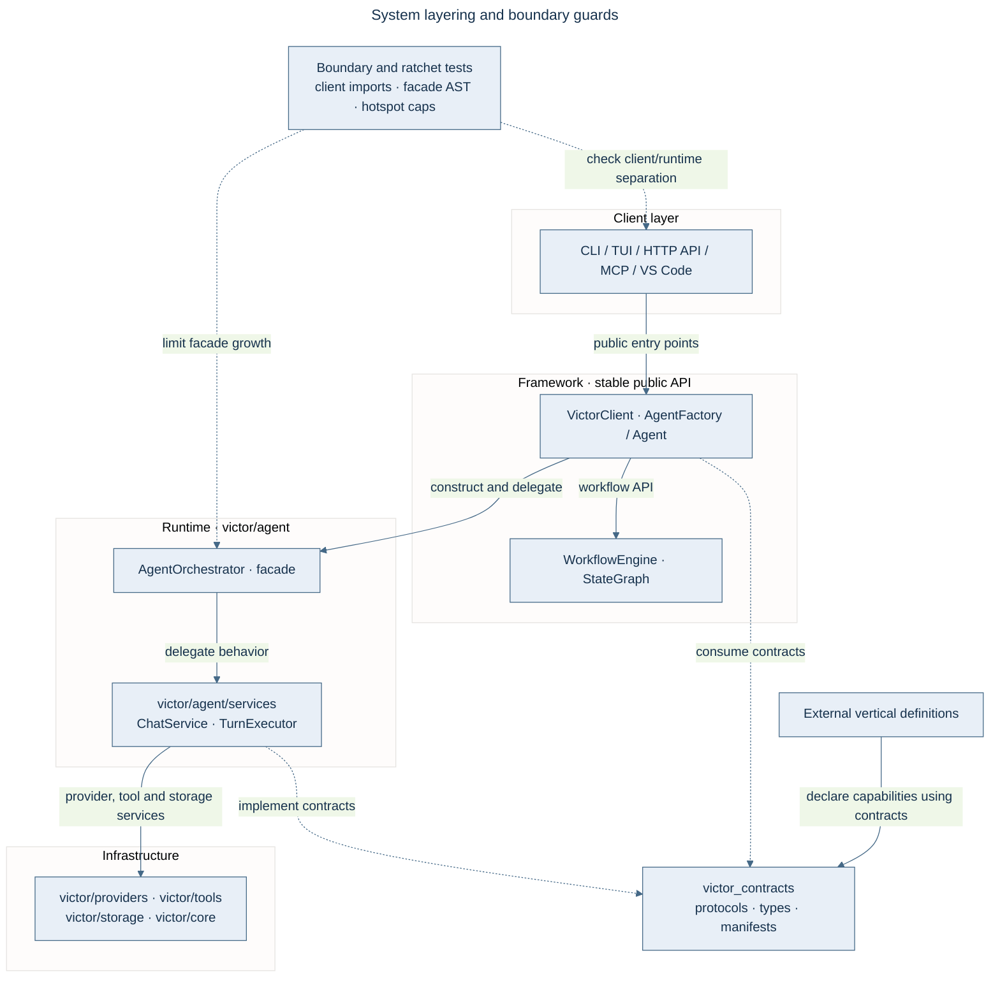

### Codebase scale

The September dead-code sweep invalidated earlier source-file and line-count snapshots.
Use repository inventory tools for those measurements. The documentation drift gate checks
provider counts against the source tree and maintains the declared tool-module inventory.

| Metric | Value |
| --- | --- |
| Provider adapters | 25 |
| Tool modules | 34 |
| Cargo crates | 5 |

### Layer Rules

| Rule | Description | Guard Test |
|------|-------------|------------|
| Clients use Framework only | UI never imports `victor.agent.*` | `test_architectural_boundaries.py` |
| Framework delegates to Runtime | `Agent.create()` goes through `AgentFactory` | Agent entry point |
| Runtime delegates to Services | Services implement behavior; turn-frame inversion remains planned in FEP-0031 | `test_service_layer_validation.py`, facade and hotspot guards |
| Services own infrastructure | Effectful behavior via `ExecutionContext.services` | Service accessor |
| Vertical definitions use Contracts | Definition files import `victor_contracts`; runtime extension allowances are separately audited | `test_contracts_import_boundaries.py`, `check_extracted_vertical_boundaries.py` |

### Data Flow

The [unified streaming sequence](#agenticloop) traces a chat turn through the runtime.
The [workflow engine diagram](#workflow-engine) traces definition-based execution.

---

## Layer Architecture

Victor follows a strict layered design. Clients enter through framework APIs; runtime services own effectful behavior.
Cross-package definitions live in `victor_contracts`, with guards described above.

The [system layering diagram](#system-overview) is the canonical dependency map.
The table below identifies the owning modules.

| Layer | Module | Entry Point | Responsibility |
|-------|--------|-------------|----------------|
| **Client** | `victor/ui/` | `cli.py` | CLI, TUI, commands |
| **Client** | `victor/integrations/api/` | `server.py` | FastAPI REST server |
| **Client** | `victor/integrations/mcp/` | — | MCP protocol bridge |
| **Framework** | `victor/framework/` | `agent.py` | Public API surface |
| **Runtime** | `victor/agent/` | `orchestrator.py` | Orchestration facade |
| **Runtime** | `victor/agent/services/` | `chat_service.py` | 6 canonical services |
| **Infrastructure** | `victor/providers/` | `base.py` | LLM provider adapters |
| **Infrastructure** | `victor/tools/` | `base.py` | Tool modules |
| **Infrastructure** | `victor/state/` | `__init__.py` | 4-scope state management |
| **Infrastructure** | `victor/config/` | `settings.py` | Settings and profiles |
| **Infrastructure** | `victor/core/` | `database.py` | Event sourcing, CQRS, DI |

---

## Service Layer

The runtime is **service-first**, with six canonical services and supporting runtime modules.
`AgentOrchestrator` delegates to these services, but still supplies chat setup/teardown and
collaborators. [FEP-0031](https://github.com/anvai-labs/victor/blob/develop/feps/fep-0031-chat-runtime-inversion.md) proposes moving that turn
frame into `ChatService` and replacing facade-private access with `ChatRuntimeServices`.
That inversion is a target, not the current ownership model.

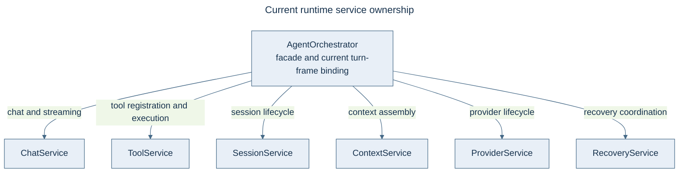

**Access pattern** via `ExecutionContext`:

```python
from victor.runtime.context import ExecutionContext

ctx = ExecutionContext(settings=settings)
chat_svc = ctx.services.chat       # ChatService
tool_svc = ctx.services.tool       # ToolService
session_svc = ctx.services.session # SessionService
```

> **Client surfaces** use public framework entry points such as `VictorClient` with
> `SessionConfig`, `Agent`, or `AgentFactory`; they do not construct `AgentOrchestrator` directly.

---

## Agent Runtime

### AgenticLoop

The `AgenticLoop` (`victor/framework/agentic_loop.py`) is the canonical execution
authority for chat. It runs: **PERCEIVE → PLAN → ACT → EVALUATE → DECIDE**.

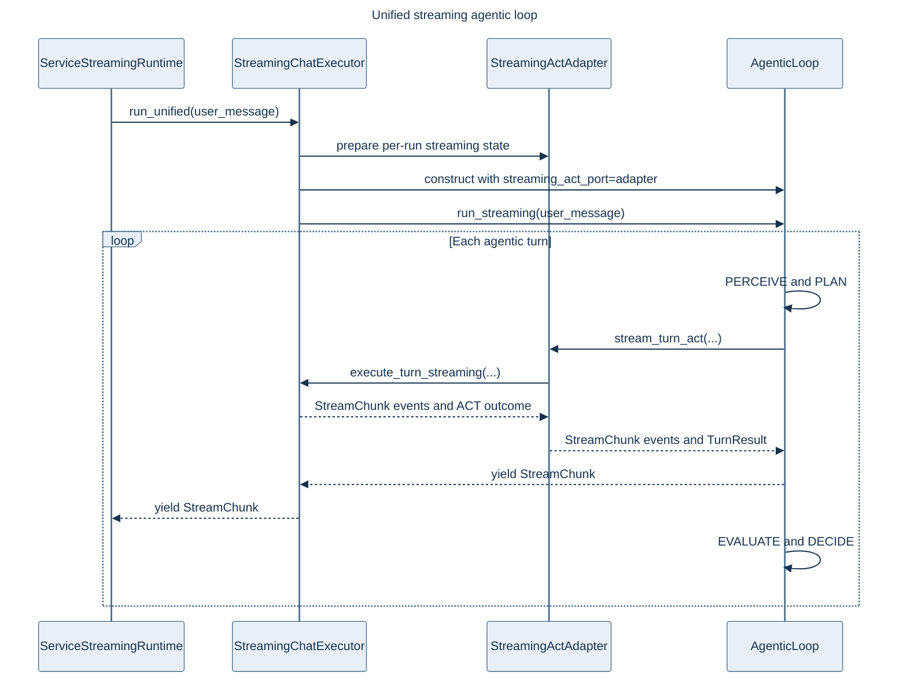

**Buffered entry point**: `TurnExecutor.execute_agentic_loop()` at
`victor/agent/services/turn_execution_runtime.py`.

**Streaming entry point**: `ServiceStreamingRuntime` in
`victor/agent/services/chat_stream_runtime.py` calls `StreamingChatExecutor.run_unified()`,
which drives `AgenticLoop.run_streaming()` through `StreamingActAdapter` and
`StreamingChatExecutor.execute_turn_streaming()`. The sequence above shows the current runtime class and ACT port.
[FEP-0007](https://github.com/anvai-labs/victor/blob/develop/feps/fep-0007-unified-agentic-loop.md) is Implemented. ADR-030 step 3 (#1043) removed the deprecated `run()` alias and unused
`AgenticLoop.stream_chat()` wrapper; `run_unified()` is the streaming entry point.

### Planned runtime and learning changes

The next ownership changes remain proposal targets:

- [Chat runtime inversion target](https://github.com/anvai-labs/victor/blob/develop/feps/fep-0031-chat-runtime-inversion.md#target-ownership-diagram): ChatService-owned turn framing.
- [Interrupt/resume target](https://github.com/anvai-labs/victor/blob/develop/feps/fep-0032-interrupt-resume-semantics.md#target-checkpoint-and-resume-flow): explicit paused signals and resume position.
- [RL relocation target](https://github.com/anvai-labs/victor/blob/develop/feps/fep-0033-rl-subsystem-relocation.md#target-package-dependencies): runtime implementation outside the framework package.

### AgentFactory

`AgentFactory` (`victor/framework/agent_factory.py`) is the **single authority**
for all agent creation paths (CLI, API, `Agent.create()`). It validates config,
bootstraps the DI container, creates the orchestrator, and wires observability.

---

## Provider System

The provider diagram distinguishes implementations from optional routing.

25 LLM provider adapters behind a unified interface with circuit breaker,
retry, and smart routing (multi-provider selection/fallback via
`victor/providers/smart_router.py`). The consolidated provider gateway
feature layer — semantic caching, budget guardrails, routing-performance
work — is **planned**, not shipped
([ADR-022](architecture/adr/022-provider-gateway-feature-layer.md), TD-24;
see the [roadmap](roadmap.md)).

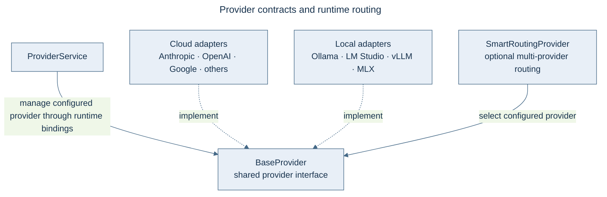

### Caching Architecture

Two independent caching capabilities per provider:

| Capability | Method | Cloud | Local |
|---|---|---|---|
| **API prompt caching** | `supports_prompt_caching()` | Billing discount | N/A |
| **KV prefix caching** | `supports_kv_prefix_caching()` | Stable prefix | Stable prefix |

**KV optimizations** (active for Ollama, LMStudio, vLLM, MLX):

- System prompt frozen after first build
- Tools sorted by name for prefix matching
- Dynamic content injected into user messages
- `Agent.warm_up()` primes KV cache

---

## Tool System

The tool diagram separates registration, selection and execution.

34 tool modules across 12 categories with semantic selection and budget enforcement.

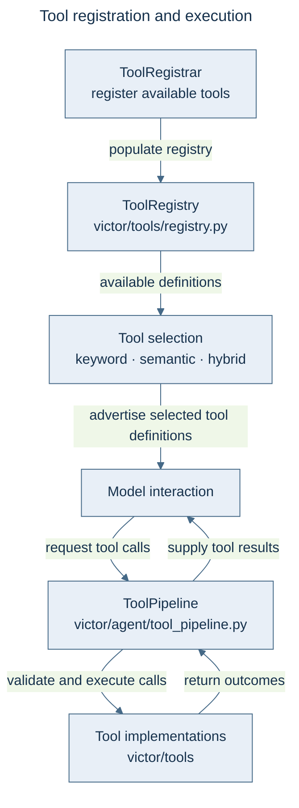

### Tool Presets

| Preset | Description |
|--------|-------------|
| `default()` | Standard production set |
| `minimal()` | Read-only, safe operations |
| `full()` | All available tools |
| `airgapped()` | Local-only, no network |

---

## Workflow Engine

Workflow definitions compile through `NativeWorkflowGraphCompiler` to `CompiledGraph`,
with typed state, conditional edges and checkpointing. ADR-030 step 2 (#1042) routes definition
callers through `create_legacy_workflow_executor()` → `StateGraphWorkflowExecutor` →
`StateGraphExecutor`; the adapter returns `WorkflowResult` with flat final state, per-node
results, tool counts and optional pause metadata.

[ADR-030 step 3](architecture/adr/030-single-graph-execution-engine.md) (#1043) removes the
BFS walker and the streaming wrapper's traversal loop. `StreamingWorkflowExecutor` observes
canonical graph execution per invocation; closing or cancelling the stream stops and awaits
its downstream work. The old executor import names resolve to the compiled adapter.
The diagram below describes the single workflow execution engine.

Ordinary multi-successor DAGs preserve breadth-first traversal and checkpoint their pending
frontier. Mixed ordinary fan-out/cycles, mixed dynamic `Send`, and node-based replay of a
sequential-frontier checkpoint are explicitly unsupported. The adapter also rejects legacy
node-result caches, `continue_on_failure=True`, and definition execution with a legacy
checkpoint ID; use a graph checkpointer and `thread_id` for compiled checkpoint persistence.

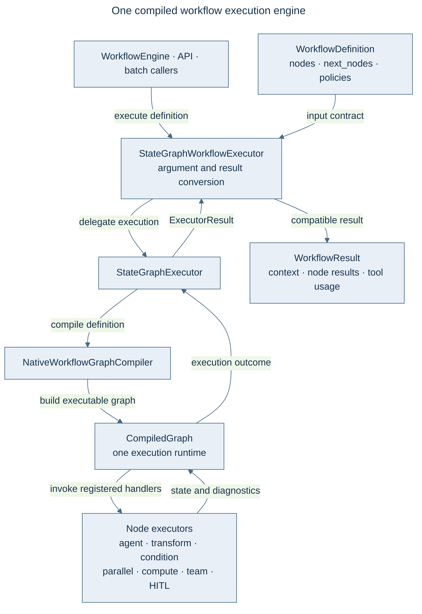

### StateGraph Features

- **Typed state** — `TypedDict` state schemas
- **Conditional edges** — Route based on state values
- **Cyclic graphs** — Loopback edges for single-path graphs; not combined with ordinary fan-out
- **Checkpointing** — Persist and resume state
- **Copy-on-write** — Efficient state mutations
- **Human-in-the-loop** — Interrupt hooks exist; the general paused-result signal and resume-at
  semantics remain [FEP-0032](https://github.com/anvai-labs/victor/blob/develop/feps/fep-0032-interrupt-resume-semantics.md) work. Step-2 result
  fields preserve a signal when supplied; they do not implement that design.

---

## Multi-Agent Teams

The team diagram shows coordination inside a workflow node.

Teams are **formations** (coordination patterns) that can be used as StateGraph nodes.
Workflow execution and streaming use `CompiledGraph`. Team durability does not imply that
the general graph interrupt/resume redesign in FEP-0032 has shipped.

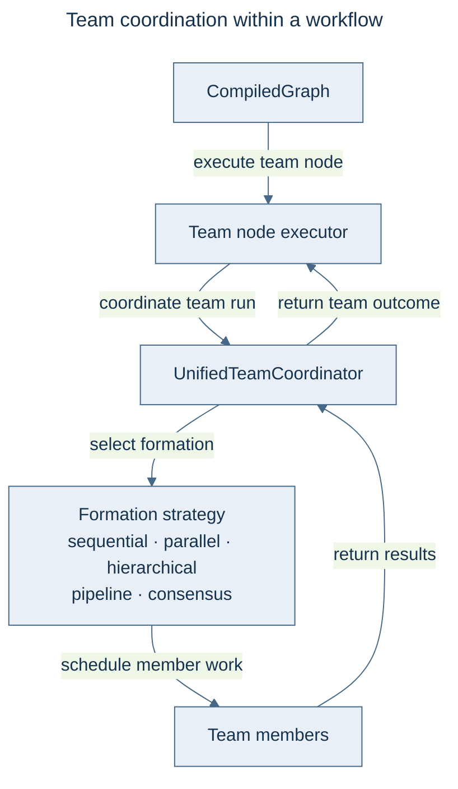

### Correct Usage

```python
from victor.framework import StateGraph
from victor.teams import UnifiedTeamCoordinator, TeamFormation

coordinator = UnifiedTeamCoordinator(orchestrator)
coordinator.set_formation(TeamFormation.PARALLEL)
coordinator.add_member(agent1).add_member(agent2)

graph = StateGraph(AgentState)
graph.add_node("research_team", coordinator)  # Direct usage!
```

> **Do not** create wrapper nodes for each formation or separate "multi-agent graph" types.

---

## State Management

The scope diagram lists the state manager’s four access domains.

Unified state management across 4 scopes with the `GlobalStateManager` facade
providing a single entry point with copy-on-write optimization.

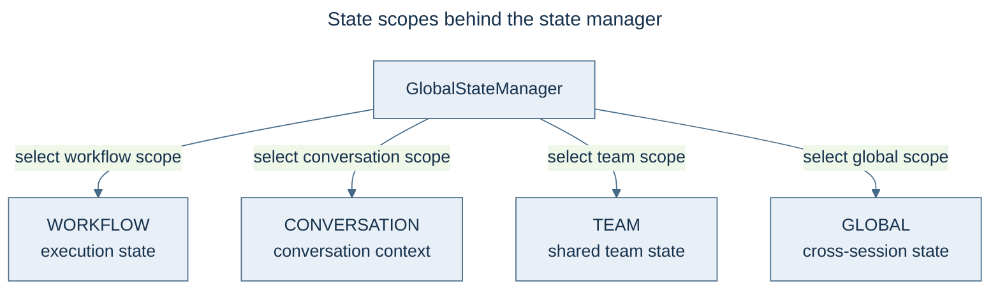

---

## Governance, Isolation & Cost

Cross-cutting runtime subsystems layered over tool execution and the provider path
(see [Features](features.md) for the user-facing summary):

- **Policy engine** (`victor/framework/policies/`) — evaluates **ALLOW / DENY / ASK** verdicts over
  tool calls across REQUEST and RESPONSE phases (streaming and non-streaming). ASK routes to a
  container-registered approval handler. Gated by `USE_POLICY_ENGINE` + `governance.enabled`.
- **Sandbox isolation** (`victor/tools/sandbox/`) — wraps subprocess/code-execution tools in an OS
  sandbox (bwrap on Linux, seatbelt on macOS), gated by `settings.sandbox.sandbox_enabled`
  (off by default, fail-open).
- **Cost co-design** — the dominant cost term (provider round-trips × context size) is measured and
  acted on: per-turn cost trace (**C0**, surfaced in the chat UI footer), reference-aware
  tool-result pruning (**L1**), per-task prompt-recompute caching (**L2**), and cost/latency-aware
  routing (**L4**, with `USE_SMART_ROUTING`).

## Additional Subsystems

Live packages under `victor/` that support the runtime but sit outside the core layer diagram
above:

| Package | Purpose |
|---------|---------|
| `victor/coordination/` | Multi-agent coordination — formation strategies for team execution. |
| `victor/classification/` | Unified task-type + complexity detection (consolidated pattern matching). |
| `victor/optimization/` | Workflow optimization algorithms (automated workflow tuning). |
| `victor/experiments/` | MLflow-like experiment tracking for workflow optimization. |
| `victor/analytics/` | Backward-compat namespace routing to `victor/observability/analytics/`. |
| `victor/benchmark/` | Benchmark vertical — high-level API for AI coding evaluations. |
| `victor/iac/` | IaC security scanner (Infrastructure-as-Code file scanning). |
| `victor/native/` | Re-exports of Rust/native processing hot paths (`victor/processing/native/`), with Python fallback. |

## Database Architecture

Victor separates global and project state, with a dedicated undo database for file-edit
history. Schema versions are maintained in `victor/core/schema.py` and the database migration
code; this page describes ownership rather than duplicating a mutable schema version.
The diagram separates code-graph I/O from workflow failure and checkpoint handling.
`SqliteGraphStore` routes asynchronous database calls and result materialization through one
worker per store; constructor/schema initialization also has synchronous paths.

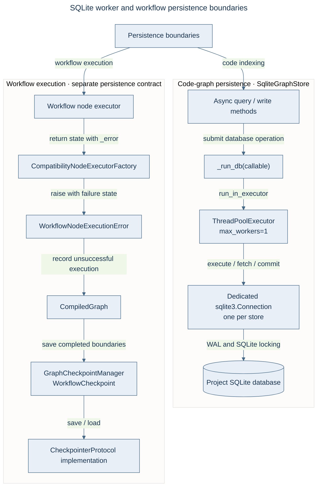

| Database | Path | Contents |
|----------|------|----------|
| **Global** | `~/.victor/victor.db` | Settings, API keys, RL data, team stats, TUI sessions |
| **Project** | `./.victor/project.db` | Graph, conversations, sessions, cache |
| **Undo** | `./.victor/undo.db` | File-edit undo/redo history (change groups + file changes) |

`SqliteGraphStore` uses a dedicated connection per store and a single-worker executor for
async database operations, including query result materialization. Its code-graph data is
separate from workflow `WorkflowCheckpoint` / `CheckpointerProtocol` persistence. Workflow
node executors signal failure through `_error`; the compiler compatibility wrapper raises
`WorkflowNodeExecutionError` so the graph run reports failure.

**Access pattern:**

```python
from victor.core.database import get_database, get_project_database
from victor.core.undo_database import get_undo_database

global_db = get_database()    # ~/.victor/victor.db
project_db = get_project_database()  # ./.victor/project.db
undo_db = get_undo_database()  # ./.victor/undo.db
```

**Why undo.db is separate:** `project.db` is written continuously by the graph
indexer (reindex-on-save). SQLite serializes writers even under WAL, so the
tiny per-edit undo write kept losing the write-lock and failing with
`database is locked` — silently dropping undo history. A dedicated `undo.db`
gives the undo writer its own lock (never contends with the indexer) and lets
multiple sessions editing the same project record history concurrently. Undo
history is rebuildable/ephemeral; durable rollback is covered by file backups
in `.victor/backups/`.

**Direction — correlated graph + vector backend (partially shipped behind a per-repo flag):** the default Code Context Graph
(SQLite `graph_*`) and the LanceDB embedding index are hand-joined today
(`graph_node.embedding_ref` is unpopulated). The Proxima backend now writes one authoritative
ProximaRecord containing complete node properties + vector + staleness markers under a single
`oid`, with ORION as a rebuildable traversal projection; its local Tier-A/Tier-B boundary is also
implemented. SQLite remains default pending the remaining benchmark, service-mode and graduation gates;
live embedded parity was verified on 2026-08-05. The optional dependency is pinned to
`proximadb>=0.3,<0.4`, and 0.3.0 is the release baseline for this review. This is tracked as TD-11/TD-12/TD-13 on the
[roadmap](roadmap.md) — design in
[ProximaDB as the CCG Backend](architecture/proximadb-codegraph-backend.md).

---

## Configuration System

Settings, named profiles and explicit session options meet at framework construction.
The configuration-input diagram shows these distinct inputs; it does not imply that a
profile file overwrites every environment setting.

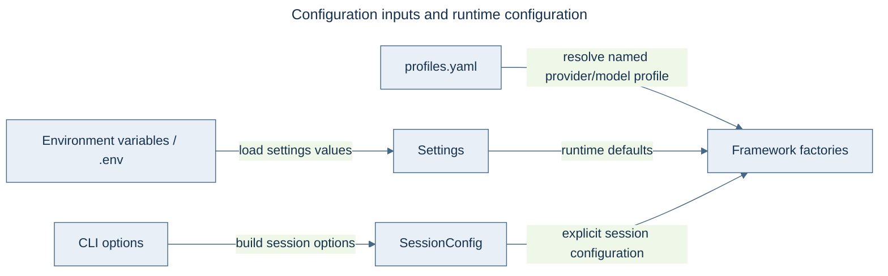

**Key config groups** (26+ nested groups in `victor/config/settings.py`):

| Group | Purpose |
|-------|---------|
| `ProviderSettings` | LLM provider configuration |
| `ToolSettings` | Tool registration and budgets |
| `SearchSettings` | Code search configuration |
| `ResilienceSettings` | Retry and circuit breaker |
| `SecuritySettings` | Safety and access control |
| `EventSettings` | Event sourcing configuration |
| `PipelineSettings` | Middleware pipeline |
| `PromptOptimizationSettings` | Runtime prompt evolution |

---

## Extension System

Three orthogonal integration mechanisms:

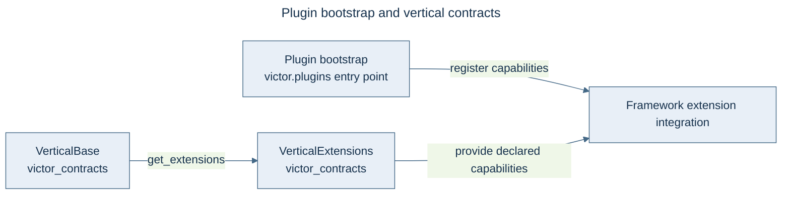

| Concept | Role | SDK Type | Lifecycle |
|---------|------|----------|-----------|
| **Plugin** | Bootstrap registrar | `VictorPlugin` | Transient: `register()` called once |
| **Vertical** | Configuration template | `VerticalBase` | Class-level: classmethods called |
| **Extension** | Runtime service | `VerticalExtensions` | Object-level: lazy-loaded |

**External packages** should import from:
- `victor_contracts` — Protocol/contract definitions
- `victor.framework.extensions` — Extension surfaces
- Never import `victor.agent.*` from external packages

### Extension Points

| Extension | How | Location |
|-----------|-----|----------|
| **Providers** | `BaseProvider` subclass | `victor/providers/` |
| **Tools** | `BaseTool` subclass | `victor/tools/` |
| **Workflows** | YAML DSL or StateGraph | `victor/workflows/` |
| **Middleware** | Pre/post hooks | `victor/agent/tool_pipeline.py` |

---

## Rust Native Extensions

The workspace diagram separates native hot paths from their Python parity references.

Optional PyO3 extensions in `rust/` for performance-critical hot paths.

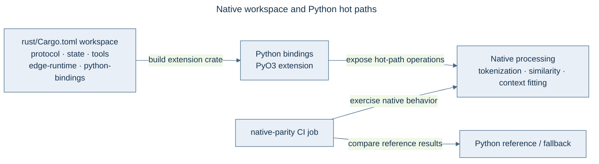

**Build**: follow the [canonical native extension recipe](development/setup.md#native-extension-build).

**Fallback pattern**: native processing paths provide Python fallbacks when Rust extensions
are absent. Exact token counting uses native `BpeTokenizer` with the Python reference behavior;
the required `native-parity` job in `CI Success` checks native/fallback agreement.

---

## Integration Points Map

Canonical maps and entry-point lookup:

Use the [system layering diagram](#system-overview) for package dependencies,
[extension diagram](#extension-system) for plugin wiring, and
[workflow engine diagram](#workflow-engine) for execution. These are the canonical
views; the entry-point table below is an index, not a second dependency model.

### Key Entry Points Summary

| Component | Path | Role |
|-----------|------|------|
| `Agent` | `victor/framework/agent.py` | Public API — `run()`, `stream()`, `chat()` |
| `StateGraph` | `victor/framework/graph.py` | DAG workflow engine |
| `AgentOrchestrator` | `victor/agent/orchestrator.py` | Central facade |
| `ChatService` | `victor/agent/services/chat_service.py` | Primary chat entry |
| `ToolService` | `victor/agent/services/tool_service.py` | Tool registration/execution |
| `AgentFactory` | `victor/framework/agent_factory.py` | Single authority for agent creation |
| `VictorAPIServer` | `victor/integrations/api/server.py` | FastAPI REST endpoint |
| `VictorClient` | `victor/framework/client.py` | UI layer entry point |
