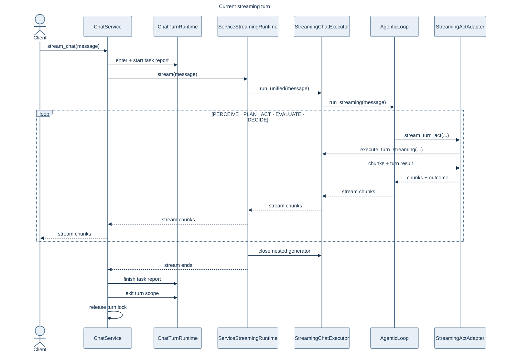
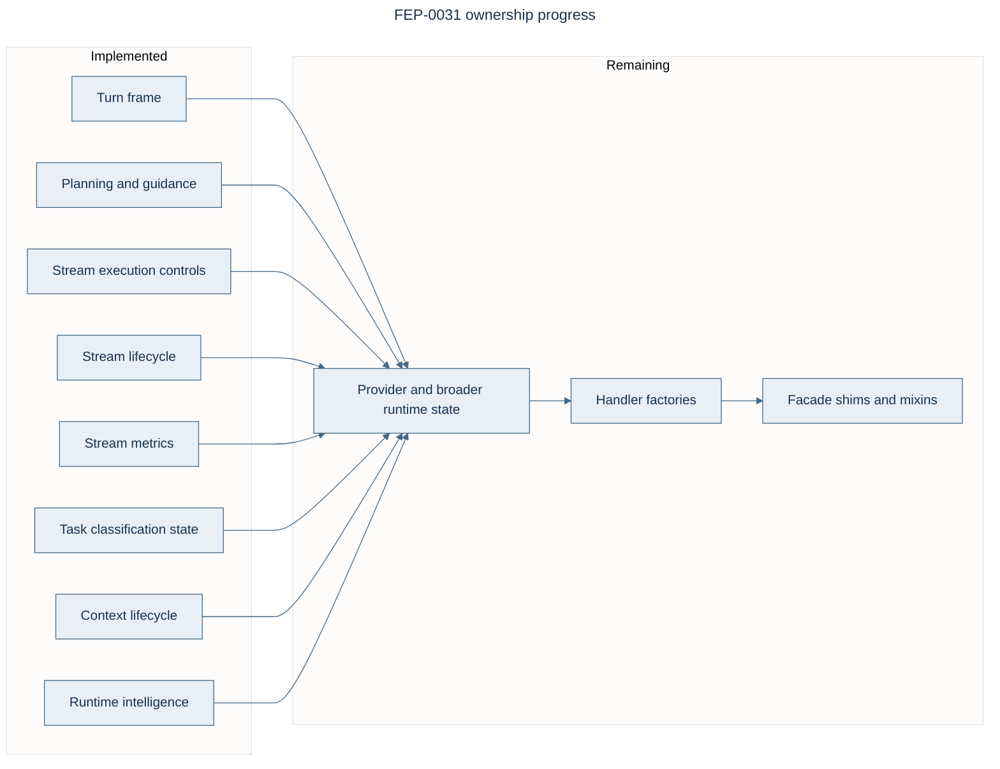

# Streaming Runtime

!!! abstract "Current path"

    `ChatService` frames the turn. `ServiceStreamingRuntime` calls
    `StreamingChatExecutor.run_unified()`, which drives the single
    `AgenticLoop.run_streaming()` path through `StreamingActAdapter`.

    The deprecated `run()` alias, `AgenticLoop.stream_chat()` wrapper and
    `_stream_chat_impl` path are removed.

## Turn flow

## Capability map

The stream cluster receives an enumerated `ChatRuntimeServices` view. Related operations share
one capability so callers do not accumulate facade fields.

| Capability | Owns | Failure behavior |
| --- | --- | --- |
| Session requirements | Required files, outputs and read state | Live session owner |
| Delivery | Request and response delivery | Existing delivery contract |
| Planning | Task preparation, goals, intent, guidance and tool selection | Required wiring fails early |
| Governance | Request/response policy | Invalid configured result fails closed |
| Completion | High-confidence completion and clean summary | Optional when disabled |
| Conversation | System-prompt insertion, history, actual usage and terminal summary persistence | Startup fails closed; later accounting is best effort; weak owner |
| Tool calls | Reset, parse and validate | Missing runtime fails closed |
| Stream lifecycle | Start, context binding, cancellation, retry timing and cleanup | Required; weak live owner |
| Stream metrics | Initialization, first-token timing, cost and terminal diagnostics | Required; weak live owner |
| Task state | Reset, classification, continuation and prompt-derived budgets | Required; weak live owner |
| Context lifecycle | Background compaction startup | Optional; weak live owner |
| Runtime intelligence | Request guidance, learned routing and outcome feedback | Optional; weak live owner |
| Recovery | Retry and fallback coordination | Existing recovery contract |

!!! note "Limit ownership"

    `AgenticLoop.run_streaming` enforces the active iteration bound; `StreamingActAdapter` syncs
    the turn counter and `StreamingChatExecutor` checks cancellation around provider/tool work.
    The bound `ChatService` context-limit handler remains a compatibility API and is not
    rediscovered from the stream cluster.

## Lifecycle invariants

!!! warning "Required invariants"

    - Close nested async generators before releasing the shared turn lock.
    - Finish task reports on success, error and cancellation.
    - Check cancellation around provider and tool boundaries; preserve accounting for completed
      in-flight tools, then close the loop before emitting the terminal cancellation signal.
    - Resolve mutable session and controller state from its current owner.
    - Keep configured governance gates through bootstrap; malformed results are errors.
    - Preserve one metrics path from provider usage to conversation, cost and session totals.
    - Start configured background compaction once during stream preparation.

| Guard | What it prevents |
| --- | --- |
| Stream-turn AST caps | New access to migrated orchestrator internals |
| Facade and hotspot caps | Growth in the composition facade |
| Run/stream parity | Divergence between buffered and streaming semantics |
| Lifetime regressions | Lock, generator or report leaks after cancellation |
| Usage regressions | Double counting or loss during reset/restore |

## Ownership status

FEP-0031 remains **Draft / in progress**. See the
[proposal and measured progress](https://github.com/anvai-labs/victor/blob/develop/feps/fep-0031-chat-runtime-inversion.md)
and the [canonical architecture](../architecture.md#service-layer).

## Compatibility

Public `Agent.run()`, `Agent.stream()` and facade chat methods retain their contracts.
Compatibility coordinators forward to the service/runtime path; they do not own a second
streaming engine.
