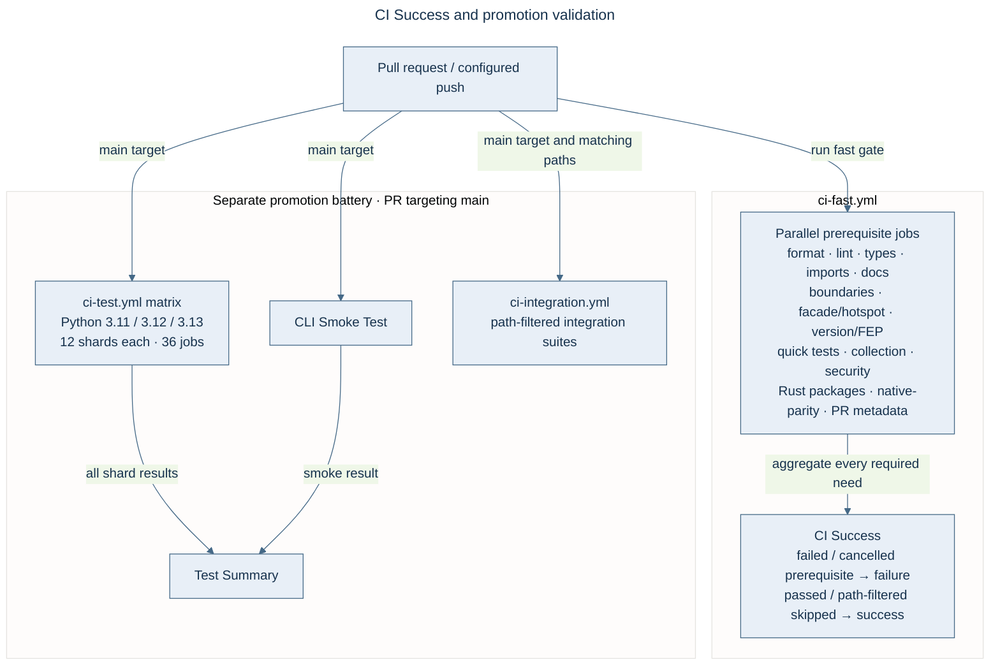

# Pull requests and release workflow

Feature and maintenance changes target `develop`. Promotion pull requests target
`main`. Always specify the base branch: the repository default is `main`.

## Work in a linked worktree

Keep the main checkout on `main` or `develop`, and keep local configuration and
unrelated changes there. Create one worktree per pull request:

```bash
git fetch origin
git worktree add ../victor-my-task -b refactor/my-task origin/develop
cd ../victor-my-task
```

Keep the fewest active worktrees needed. A second worktree is appropriate for
independent work that can progress while another pull request awaits CI. Remove
each worktree and its local/remote branch after merge.

## Validate and open a pull request

Run targeted tests and the full affected suites, Black, Ruff, and MyPy on touched
production files. Before pushing, run the full collection check to catch stale
imports across the test matrix:

```bash
python -m pytest tests/ --collect-only -q
```

For concurrency, shared state, security, or layering changes, obtain an independent
adversarial review before requesting merge. Reproduce findings and add positive
and negative regression coverage in the same pull request.

Use conventional commit and PR titles such as `feat:`, `fix:`, `refactor:`,
`docs:`, or `ci:`. `release:` is not an accepted PR title type. Commit and PR text
must not contain agent attribution.

```bash
git add path/to/changed-file
git commit -m "refactor: describe the resulting behavior"
git push -u origin refactor/my-task
gh pr create --base develop --head refactor/my-task \
  --title "refactor: describe the resulting behavior" --body-file /tmp/pr-body.md
```

Review the final pushed commit's checks. `CI Success` is the required aggregate:
it includes lint, types, import/boundary guards, changed-file tests, full-suite
collection, security checks, Rust packages, and native parity. Queued runners are
not test failures. See the [workflow gating map](https://github.com/anvai-labs/victor/blob/develop/.github/workflows/README.md).

## Minimize CI cycles

Hosted runners are shared across the organization. Complete the local change,
dependency resolution, affected tests, formatting/lint/typing, full collection and
required independent review before the first push. Batch compatible fixes and
related docs/version preparation into a reviewable candidate.

Target one passing candidate cycle per PR and one promotion battery per closed
release batch. This is an efficiency target, never a reason to waive failures,
skip required checks, or delay an urgent security fix. Resolve all known failures
locally before a consolidated follow-up push. Re-run only failed jobs when there
is evidence of a transient infrastructure failure; changed code needs checks on
its new commit. Do not restart queued jobs or use remote CI as an edit/test loop.
Cancel only superseded runs belonging to this task, never unrelated work.

Keep the required aggregate reporting on every PR. Use shared scan reports and
compatible caches to remove duplicate work; test path filters and publication
prerequisites before changing them. Close the batch and inspect runner demand
before opening its promotion. Routine dependency updates are grouped; security
alerts receive prompt triage independently of the weekly update schedule.

## Merge and clean up

Merge only after the final commit's required checks and review pass. Squash merge
feature PRs into `develop`. An authorized maintainer may use `--admin`; this does
not replace verification of `CI Success`.

```bash
gh pr merge PR_NUMBER --squash
# Return to the main checkout before removing the worktree.
cd ../victor
git fetch origin
git worktree remove ../victor-my-task
# A squash-merged branch is not an ancestor: verify the merged PR before deleting it.
git branch -D refactor/my-task
# Delete the remote branch if GitHub has not already removed it.
git push origin --delete refactor/my-task
```

## Promote and release

Victor AI and `victor-contracts` use independent release trains. `VERSION` is the
AI version source; update it on `develop`, run `python scripts/sync_version.py
--ai`, and verify synchronization. The contracts package keeps its own version.

1. Open a `develop` → `main` promotion PR with an explicit `--base main`.
2. Wait for the promotion battery, including its sharded unit/integration,
   packaging, CLI smoke, and security checks. Feature-PR validation alone does
   not certify a release.
3. Merge the promotion using a **merge commit**, preserving ancestry.
4. Tag that main merge commit `vX.Y.Z`. `release.yml` publishes the AI package,
   native artifacts, Docker image, and GitHub Release.
5. Independently tag a contracts release `sdk-vX.Y.Z` to invoke
   `release-contracts.yml`.

For an older squash-merged promotion, reconcile main's ancestry into develop
with a reviewed sync merge. Do not routinely rebase or force-push shared
integration branches. The September 2026 promotion sync used an `ours` merge only
after verifying that develop already contained the promoted content.

Framework API and architectural changes follow the [FEP process](../FEP_PROCESS.md).
The [proposal index](https://github.com/anvai-labs/victor/blob/develop/feps/README.md) records design status; merged design
documents do not by themselves establish implementation completion.

## CI gate map

The CI gate map groups actual jobs by responsibility. `CI Success` includes native parity;
failed or cancelled prerequisites fail the aggregate, while path-filtered skips are accepted.
The promotion battery is separate and runs on pull requests targeting `main`.


