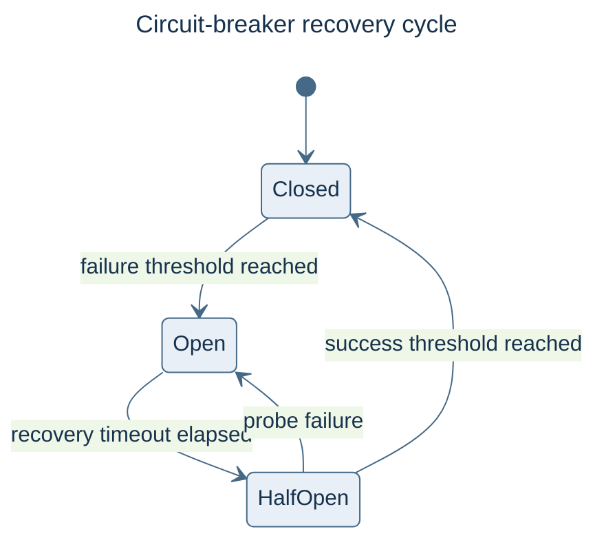

# Resilience

The public resilience facade is `victor.framework.resilience`. It re-exports provider
circuit breakers and the shared retry strategies; the removed
`victor.observability.resilience` module is not an alternative import path.

## Retry strategies

```python
from victor.framework.resilience import ExponentialBackoffStrategy, with_retry

@with_retry(ExponentialBackoffStrategy(max_attempts=3))
async def fetch_with_retry():
    # Replace with your asynchronous operation.
    return "ready"
```

Other exported strategies include `LinearBackoffStrategy`, `FixedDelayStrategy`, and
`NoRetryStrategy`. `RetryExecutor` supports explicit execution instead of a decorator.
Choose retryable failures and limits appropriate to the operation: retrying an external
write may repeat its side effects.

## Provider resilience

`ResilientProvider` combines a primary provider, optional fallback providers, circuit
configuration, and provider retry configuration. Configure it when constructing runtime
provider services. These are provider objects, not arbitrary `Agent.create` keywords.
The facade exports `CircuitBreaker`, `CircuitBreakerRegistry`, `CircuitBreakerConfig`,
and `ProviderRetryConfig` for that integration.

## Observability

Use [topic-based events](observability/event-bus.md) for runtime instrumentation. A
telemetry bus is not a bulkhead, rate limiter, or durable retry queue. The earlier guide
advertised unimplemented `Bulkhead`, `RateLimiter`, and category-based bus helpers;
those examples are preserved only in [page history](https://github.com/anvai-labs/victor/commits/develop/docs/guides/RESILIENCE.md).

## Circuit-breaker lifecycle

The circuit-breaker recovery cycle moves between closed, open, and probe states.


