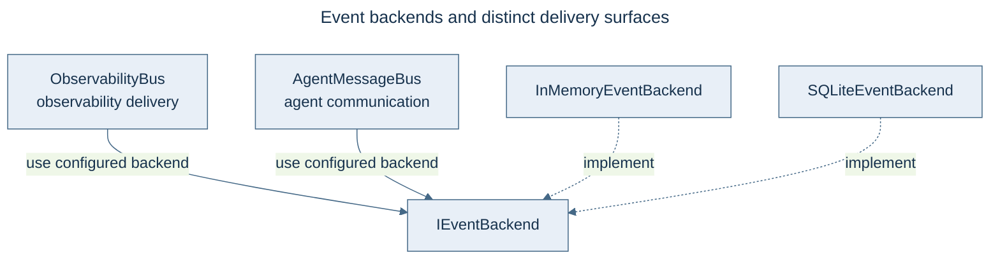

# Observability Event Bus

Runtime observability uses `victor.core.events.ObservabilityBus`. Its events are
`MessagingEvent` objects with a string `topic` and a `data` mapping. Subscriptions and
emission are asynchronous. The removed `victor.observability.event_bus` module and its
`EventCategory` enum are not current APIs.

## Subscribe and emit

This example owns a bus for its lifetime and unregisters the subscription on exit.
Topic patterns such as `metric.*` match related events.

```python
import asyncio
from victor.core.events import MessagingEvent, ObservabilityBus

async def main():
    bus = ObservabilityBus()
    await bus.connect()

    received = asyncio.Event()

    async def on_metric(event: MessagingEvent):
        print(event.topic, event.data)
        received.set()

    handle = await bus.subscribe("metric.*", on_metric)
    try:
        await bus.emit("metric.latency", {"value": 42.5}, source="example")
        await asyncio.wait_for(received.wait(), timeout=1.0)
    finally:
        await bus.unsubscribe(handle)
        await bus.disconnect()

asyncio.run(main())
```

## Shared application bus

Runtime integrations can obtain the configured bus with `get_observability_bus()`
from `victor.core.events`. The application owns that shared bus's lifetime: remove
your subscription when finished, and let the application manage connection shutdown.
Handlers receive `MessagingEvent`, not the removed event category/priority structure.

## Delivery and failure behavior

Observability emission uses `AT_MOST_ONCE` delivery. `emit()` returns a boolean and
handles `EventPublishError` as an observability failure rather than crashing the
application. It is not a durable task queue. Reliable agent communication has a separate
`AgentMessageBus`; backend capabilities determine delivery guarantees.

## Agent streams and exporters

`Agent.stream()` emits framework events (`EventType`), a separate surface intended
for application consumers. See [Python API](../../reference/api/python-api.md).
For event logging and the dashboard, see [metrics](metrics.md). Exporters subscribe
to runtime topics; do not use an `EventCategory` filter copied from older examples.

## Architecture

The [event-bus boundary guide](../../architecture/data-flow-eventbus.md) explains how
framework streams, instrumentation, and messaging relate. The earlier category-based
bus guide is retained in [page history](https://github.com/anvai-labs/victor/commits/develop/docs/guides/observability/event-bus.md).

## Event backends

The event backends diagram separates telemetry, messaging, and protocol adapters.


