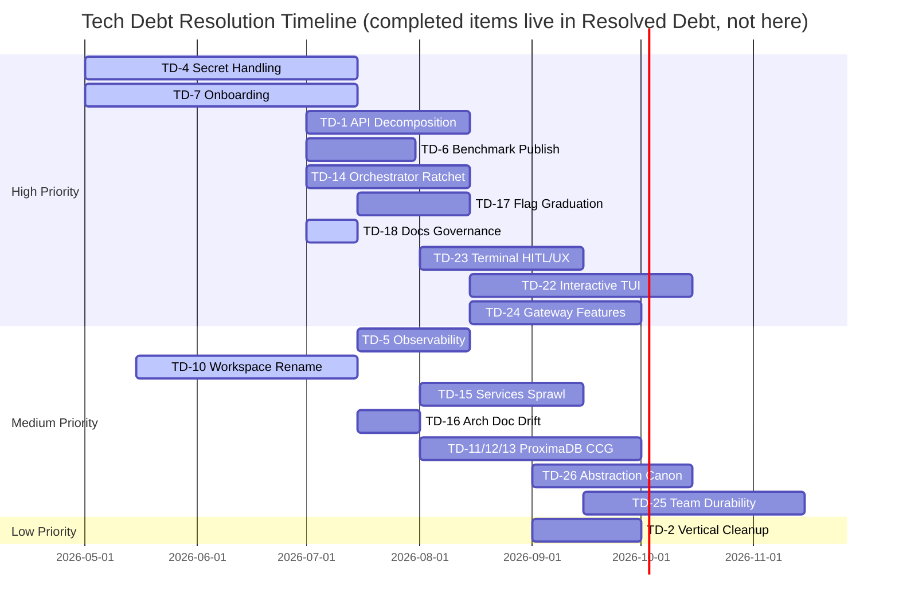

# Victor Roadmap

> **Canonical roadmap.** Referenced by `docs/index.md`, `docs/README.md`, and the root
> `README.md`. Restored to version control 2026-07-02 — the previous `docs/roadmap.md`
> existed only as an untracked local file and was lost.
>
> Companion documents: [Vision](https://github.com/anvai-labs/victor/blob/develop/VISION.md) · [Tech-debt register](#technical-debt-register) ·
> [EVR backlog](architecture/evaluation-centric-runtime-backlog.md) ·
> [Release-readiness MVP](release-readiness-mvp.md) · [Architecture](architecture.md)

**Operating principle** (from the evaluation-centric runtime vision): an agent is a *model +
harness*, and the harness is what we can engineer. The roadmap therefore prioritizes closing the
evaluation loop and gating every change on it over adding new capabilities.

---

## Now — September 2026: v0.9.3 release snapshot and remaining Stage C work

`victor-ai` 0.9.1 and `victor-contracts` 0.9.1 were released on 2026-09-07, on independent
release trains. The release covered co-design Waves 1–2, Wave 3 Stage A implementation,
and Stage B design documents. Released on 2026-09-08, 0.9.2 added post-release CI, storage and
integration fixes (#1038–#1040), ADR-030 workflow consolidation (#1041–#1043), and the
documentation refresh. These changes are not part of the 0.9.1 artifacts.

The 0.9.3 source snapshot raises the GitPython floor to 3.1.59 for CVE-2026-78676
(#1050) and includes the first FEP-0031 session and response-delivery capability
slices (#1049, #1051). The broader runtime inversion remains incomplete.

The [co-design review backlog](reviews/2026-09-03-codesign/README.md) is the detailed item/PR
ledger. Its unit reviews remain a dated record; the execution status below does not rewrite
those original findings.

| Work | Current status | Design / tracker |
| --- | --- | --- |
| ADR-030 workflow engine consolidation | Completed in #1041–#1043: parity gate, adapter/caller migration, canonical streaming and BFS deletion. | [ADR-030](architecture/adr/030-single-graph-execution-engine.md), item 23 |
| Unified chat-loop cleanup | FEP-0007 is Implemented; #1043 removed zero-caller aliases and corrected delegation comments. Optional buffered-only bands remain a separate parity follow-up. | [FEP-0007](https://github.com/anvai-labs/victor/blob/develop/feps/fep-0007-unified-agentic-loop.md), item 23 |
| Chat runtime inversion | Partial phase 1: `ChatRuntimeServices.session` and `.delivery` bind existing owners (#1049, #1051). Remaining capabilities and ChatService-owned turn framing are pending. | [FEP-0031](https://github.com/anvai-labs/victor/blob/develop/feps/fep-0031-chat-runtime-inversion.md), item 27 |
| REPL and completions client routing | Pending after runtime consolidation. | Review item 32 |
| Graph interrupt/resume semantics | Design merged; general paused signal and resume-at semantics remain pending. | [FEP-0032](https://github.com/anvai-labs/victor/blob/develop/feps/fep-0032-interrupt-resume-semantics.md), item 24 |
| Team coordinator split | Pending service extraction. | Review item 30 |
| Benchmark consolidation and RL relocation | Benchmark work precedes contracts-first relocation into `victor/rl/`. | [FEP-0033](https://github.com/anvai-labs/victor/blob/develop/feps/fep-0033-rl-subsystem-relocation.md), items 31 and 29 |
| Vertical template bases | Pending family-by-family extraction into contracts. | [ADR-031](architecture/adr/031-vertical-template-bases-promotion.md), item 28 |
| Documentation refresh | D1 consolidation, D2 diagrams, and D3 Pages/checker shipped with 0.9.2. GitHub Pages is live and updates through main promotion. | TD-18, [documentation audit](development/docs-audit-2026-09.md) |

FEP-0031/0032/0033 currently retain **Draft** frontmatter. A merged design document does not
mean its full proposed implementation has shipped. This page describes the **0.9.3** source
snapshot; the [release history](https://github.com/anvai-labs/victor/releases) records
published artifacts.

## Evaluation roadmap — existing gates and remaining work

The gate for defaulting-on any judge-based completion is ADR-011's reliability threshold — no
graduation without measured κ/α against independent labels on the shipping distribution.

| Order | Item | ADR | State |
|-------|------|-----|-------|
| 1 | EVR-1 trajectory-eval harness | — | Shipped (machinery) |
| 2 | EVR-2 LLM-judge reliability gate — run the κ/α validation | ADR-011 | **DONE — gate produced a NO-GO.** Verifier gold was validated (annotator↔verifier κ=1.0, run 12) and llama3.3:70b passed scripted/calibration-corpus packs, but failed the later SWE-bench-lite shipping-distribution re-gate (α=0.26). The identity pin remains an opt-in safety/fallback guard; it does not authorize a default. See `benchmarks/judge_calibration/FINDINGS.md` (removed with the concluded research apparatus; recoverable via git history) and `docs/architecture/judge-independence-experiments.md`. |
| 3 | EVR-3 rubric completion evaluator — must match-or-beat `EnhancedCompletionEvaluator` before becoming default | ADR-009 | **NO-GO / default stays `enhanced`.** The calibration-corpus result was positive (llama3.3:70b α=0.878 vs enhanced −0.837), but the later in-container-verified SWE-bench-lite re-gate failed on the shipping distribution (llama α=0.26; gemma α=−0.52). Prong-B verifier-backed A/B machinery now exists (`victor/evaluation/completion_strategy_ab.py`) for future re-evaluation, but cannot override the failed reliability prerequisite. See [evr3-parity-results](architecture/evr3-parity-results.md) and `benchmarks/judge_calibration/FINDINGS.md` (removed with the concluded research apparatus; recoverable via git history). |
| 4 | EVR-4 effect-grounded completion gate | ADR-010 | Shipped opt-in (`victor/framework/effect_gate.py`; `effect_gated_completion` / `VICTOR_EFFECT_GATED_COMPLETION`, default off pending flag-graduation gate; A/B graduation battery not yet built) |
| 5 | EVR-5 regression-gated harness acceptance oracle | ADR-012 | **Shipped** (ADR-012 Accepted; `victor/evaluation/acceptance_oracle.py` + `htir.py`, promotion-gated via `tests/integration/streaming/test_acceptance_oracle_gate.py`) |
| 6 | EVR-6 online per-turn auditor (`TurnAuditor`, prefix-only CONTINUE/ALARM) | FEP-0008 Phase C | **Attempt 1 HOLD; default stays OFF.** The 2026-09-04 real-distribution run used 28 independently reviewed traces and 245 digest-pinned prefixes. DR3 lacked a healthy polarity; precision/recall were 0.0 and per-family recall was 0.0, while false-alarm rate was 0.0 and p95 latency was 1,639.2016 ms. See the [gate](architecture/evr6-auditor-gate.md) and [attempt 1 result](architecture/evr6-auditor-results-2026-09-04.md). Any new sampling is a separately declared and independently reviewed attempt; even an offline PASS would not authorize a default flip without the later flag-OFF/ON task-success A/B. |

In parallel, the high-priority debt band: TD-4 secrets, TD-7 onboarding, TD-1 API decomposition,
TD-6 SWE-bench publication, TD-14 orchestrator ratchet, TD-17 flag-graduation policy.

## Next — Q3/Q4 2026: durable code memory (correlated CPG)

Product bet #4 in [VISION.md](https://github.com/anvai-labs/victor/blob/develop/VISION.md): one entity = relational row + graph node + vector,
addressed by a single stable oid.

- Foundation shipped: `victor-codegraph` extraction (ADR-014), phased core adoption (ADR-015,
  Phase 1 live), stable line-independent `symbol_oid` (ProximaDB ADR-044, victor-codegraph 0.1.2).
- Shipped behind the per-repo flag: TD-12 one authoritative ProximaRecord for node props + vector +
  staleness under the shared oid, and TD-13's local Tier-A/Tier-B routing boundary.
- Remaining: ADR-015 later phases; TD-11 native-wheel/live-parity/default-graduation work; replacing
  Tier B's local fragment implementation with Proxima PAX/columnar fragments.
  Design: [ProximaDB as the CCG Backend](architecture/proximadb-codegraph-backend.md).

## Later — directional horizons (from VISION.md)

- **3–6 months**: contract-first extension authoring; productize observability beyond EventBridge
  and the prototype dashboard (TD-5); published benchmark evidence (TD-6); EVR P1–P2 (online
  prefix auditing, judge-validation expansion, EVR-7 credit→learner loop).
- **6–12 months**: default open-source platform layer for typed, multi-provider, multi-surface
  agent systems; external-vertical ecosystem; operations-ready deployment patterns; multi-tenant
  code-memory service.

## Governance

- Current plans are separated from dated release evidence and the historical debt timeline below.
  Preserve gate outcomes when updating statuses; do not turn a historical PASS into a current default.
- Every roadmap item cites its tracker (TD-*, EVR-*, ADR, or release-blocker list) — no orphan bullets.
- Update cadence: at each release cut and each quarter boundary, whichever comes first.

## Release history

### Historical v0.9.0 release closeout (August 2026)

v0.9.0 shipped on 2026-08-20. The `develop` promotion passed the complete required matrix, and the
tag-triggered release workflow published the Python package, native wheels, binaries, VS Code
extension, checksums, SBOM, GitHub Release, and Docker image. Source:
[release-readiness closeout](release-readiness-mvp.md).

1. **DONE — release evidence:** promotion CI and the tag-triggered release workflow completed
   successfully; public PyPI and Docker registry entries were verified.
2. **DONE — support-level enforcement:** core tests, package/CLI smoke, integration, vertical
   compatibility, artifact builds, and publication block stable releases. TestPyPI is optional for
   stable tags; Trivy remains advisory.
3. **NEXT — security follow-up:** triage the v0.9.0 Trivy SARIF findings in GitHub Security and fix or
   explicitly accept each actionable critical/high dependency or image finding.
4. **DONE — public-install evidence:** clean Python 3.11 and 3.12 environments installed
   `victor-ai==0.9.0` from PyPI, imported `victor`/`Agent`, reported version 0.9.0, and rendered CLI
   help independently of the checkout and release artifacts.
5. **DONE — modular Rust distribution:** annotated tag `rust-v0.8.0` published
   `victor-protocol`, `victor-state`, `victor-tools`, and `victor-edge` to crates.io in dependency
   order. All four registry records and checksums were verified, docs.rs built successfully, and a
   clean `cargo install victor-edge --version 0.8.0 --locked` smoke passed.
6. **ONGOING — docs governance (TD-18):** keep this file committed and verify that canonical pointer
   targets resolve at every release cut.

## Technical Debt Register

> Consolidated from `docs/tech-debt/`, `docs/architecture/` analysis, and codebase audits.
> Migrated here from `tech-stack.md` on 2026-09-07. Entries retain their individual
> verification dates; older planning estimates are historical, not delivery commitments.
> The Stage C table above is the current execution sequence.

**Namespaces.** Three ID families appear in Victor docs — keep them distinct:

- `TD-*` (this register) — Victor framework debt. Canonical here.
- `EVR-*` — evaluation-centric runtime backlog items in
  [`architecture/evaluation-centric-runtime-backlog.md`](architecture/evaluation-centric-runtime-backlog.md).
  Items tagged `techdebt` there (EVR-5, EVR-7) are debt; they stay in the EVR sequence but are
  cross-referenced below so this register remains the single lookup point.
- `TD-1xx` (e.g. TD-127, TD-128, TD-130, TD-131, TD-134 in
  [`architecture/proximadb-codegraph-backend.md`](architecture/proximadb-codegraph-backend.md)) —
  **ProximaDB engine** tickets, an external register that happens to share the `TD-` prefix. Never
  allocate Victor debt IDs in the 100+ range.

### Debt ledger

| ID | Area | Description | Priority | Status | Module |
|----|------|-------------|----------|--------|--------|
| TD-1 | API Server | API server hotspot decomposition (`victor/integrations/api/fastapi_server.py` — note: the old `server.py` path no longer exists; verify remaining scope, may be largely done at 1,046 lines) | High | Planned | `victor/integrations/` |
| TD-2 | Vertical Integration | `victor/framework/vertical_integration.py` cleanup | Medium | Planned | `victor/framework/` |
| TD-4 | Secret Handling | Normalize across provider, server, session settings | High | In Progress | `victor/providers/` |
| TD-5 | Observability | Decide: prototype or supported surface | Medium | Pending | `victor/core/` |
| TD-6 | Benchmark Publication | Publish SWE-bench results publicly | High | Planned | `benchmarks/` |
| TD-7 | Onboarding Clarity | Happy-path documentation for new users | High | In Progress | `docs/` |
| TD-10 | Workspace Isolation | Rename internals from worktree-only to workspace-first | Medium | In Progress | `victor/teams/` |
| TD-11 | ProximaDB CCG Backend | `ProximaGraphStore` and the embedded provider are implemented behind the per-repo flag with SQLite still default. **Live parity verified 2026-08-05** against a real embedded instance, after fixing an embedded-transport defect (portless UDS made every ORION call fail while record writes succeeded) and a stale parity fixture. Remaining GA work is the step-6 bench, service-mode closure, and default graduation. The `proximadb_embedded` native wheel gates ProximaDB's PyPI release, not Victor — Victor spawns a `proximadb-server` subprocess and never imports that module. See `docs/architecture/proximadb-codegraph-backend.md`. | Medium | In Progress | `victor/storage/` |
| TD-12 | Embedding↔Node Correlation | Done for the Proxima backend 2026-08-04: one authoritative ProximaRecord replacement contains complete graph properties, the vector, and staleness markers under the shared symbol `oid`; the indexing pipeline no longer performs separate vector + metadata mutations and `embedding_ref` is retired. ORION is explicitly a post-commit rebuildable projection, not falsely described as part of the record transaction. | Medium | Done | `victor/storage/graph/` |
| TD-13 | Tier-A/Tier-B CCG split | Local boundary landed 2026-08-04: Proxima keeps symbols + semantic/cross-function edges in ORION and routes statement nodes + CFG/CDG/DDG edges to durable file/scope-indexed fragments, fetched only by explicit dataflow drill-down; restart, routing, iteration, stats, and deletion are contract-tested. Remaining: replace the local SQLite fragment representation with Proxima PAX/columnar fragments and verify the ~120 MB f32 / ~35 MB SQ8 live-graph envelope. | Medium | In Progress | `victor/storage/graph/` |
| TD-14 | Orchestrator Regrowth | `victor/agent/orchestrator.py` regrew ~34% after TD-R1 declared it resolved at 3,510 lines. The facade pattern is intact (delegation to services is real), but the file remains a god-object. Decompose; ratchet guard landed 2026-07-02 (`tests/unit/runtime/test_hotspot_size_guard.py`) so it cannot silently regrow a third time — lower the caps as decomposition proceeds. **ADR-019 increments 1–11:** extracted task-report metadata, tool-supply policy, edge-model tool-necessity, KV ordering/settings/execution, provider-economics session locking, strategy utilities, context-aware strategy telemetry, and its metrics emission; then deleted two uncalled private compatibility helpers after a repository-wide audit. Orchestrator 4,690→4,225. The current ratchet is 4,225 LOC; see [ADR-019](architecture/adr/019-orchestrator-service-runtime-decomposition.md) for the per-increment record. | High | In Progress | `victor/agent/` |
| TD-15 | Services Sprawl | `victor/agent/services/` holds ~55 files, several 100k+ chars (`planning_runtime.py`, `runtime_intelligence.py`, `turn_execution_runtime.py`, `tool_service.py`) — far beyond the documented "six canonical services." Either promote the runtime modules into the documented architecture or fold them under the six services; today the story and the tree disagree. | Medium | Planned | `victor/agent/services/` |
| TD-16 | Architecture Doc Drift | DONE — scoping corrected the register's own overstatements: "34 tool modules" is the **correct gated canon** (`check_docs_drift.py` pins it; the "~79" is top-level `.py` files, not modules) and the "thin facade" wording is **not present** in `docs/architecture.md`. Real fixes shipped: added an **Additional Subsystems** section covering the 8 omitted live packages (`coordination/`, `classification/`, `optimization/`, `experiments/`, `analytics/`, `benchmark/`, `iac/`, `native/`); corrected "9 categories" → 12 (actual `ToolCategory` enum count); `git rm`'d dead `victor/tools/smart_cicd_tool.py.broken`. The docs-drift check requested already exists (`scripts/ci/check_docs_drift.py`, `docs/architecture.md` is in its scan set). | Medium | Done | `docs/` |
| TD-17 | Flag Graduation Policy | The quality/safety loop is largely opt-in: `USE_POLICY_ENGINE`, `sandbox_enabled`, rubric completion (`completion_strategy`), and L1 reference-aware pruning all default OFF. (Correction 2026-07: `USE_SMART_ROUTING` is **not** in `is_opt_in_by_default()`, so it already defaults **ON** — earlier drafts of this row and `flag-graduation-policy.md` wrongly listed it as OFF; it needs a *retro-gate* on the existing default, not graduation-to-on.) The authoritative per-flag defaults now live in a **generated** inventory — [`architecture/feature-flags.md`](architecture/feature-flags.md), rendered from `FeatureFlag` by `scripts/gen_feature_flag_doc.py` and pinned by `test_feature_flag_manifest_guard.py` — so cite it rather than restating defaults in prose. Policy + proposed per-flag gates drafted 2026-07-05: [`architecture/flag-graduation-policy.md`](architecture/flag-graduation-policy.md) — claim/gate/fallback/kill required per flag, ADR-011 as the template; the earlier calibration corpus had a candidate judge (gemma4:31b, α=0.929), but the later shipping-distribution re-gate was **NO-GO**, as recorded in the EVR table above; the calibration result does not authorize a default change. Remaining: owner ratifies the proposed gates; build gate corpora for policy-engine/routing/pruning. | High | In Progress | `victor/core/feature_flags.py`, `docs/architecture/` |
| TD-18 | Roadmap/Docs Governance | Canonical `docs/roadmap.md` was referenced by six documents but never committed to git (existed only as an untracked local file — now restored 2026-07-02). Hygiene check landed 2026-07-02 (`check_canonical_doc_pointers` in `scripts/ci/repo_hygiene_check.py`) — canonical pointer docs must exist and their relative links must resolve. The roadmap is committed. D1 consolidates the debt register here and replaces duplicate build recipes with the development setup guide; built-site link checking remains the D3 follow-up. | High | In Progress | `docs/`, `scripts/ci/` |
| TD-19 | Required Checks vs Path Filters | **Resolved trigger gap (2026-09-07):** `ci-fast.yml` runs without path-filtered PR triggers and its `CI Success` aggregate includes native parity; `ci-test.yml` also runs on every PR targeting main. **Historical failure and investigation:** branch protection required 29 named checks (`strict` + `enforce_admins`), but the producing workflows were path-filtered — a PR touching only unfiltered paths runs none of them and is **permanently unmergeable** (hit three ways on PR #379; `workflow_dispatch` runs on the head SHA do not satisfy the PR's expected-context tracking, and close/reopen resets expectations). Partially fixed: `benchmarks/**` added to ci-fast/ci-test filters; `build.yml` PR trigger unfiltered 2026-07-04 (its required check must run on every PR by definition). At that investigation date, **docs-only PRs** triggered neither ci-fast (Format/Lint required) nor ci-test (36 required Test shards). Durable options: inverse-path stub workflows posting success for the same check names, unfiltering ci-fast (cheap) + a docs-exempt required-check list, or trimming required contexts. Historically masked by develop→main batch merges that touch everything. | High | Resolved | `.github/workflows/` |

| TD-20 | Framework stdout log volume | A stuck real-agent calibration wrote **~350 GB** to one redirected log and filled the disk (2026-07-06; held open by the live PID so `rm` freed nothing until killed). Root cause on investigation was *not* a single fat log line — every content log is already bounded (`reasoning[:500]`, `content[:300]`) or a short breadcrumb. It was a **wedged loop** (PID stuck 7.5 h) emitting the steady stream of per-turn INFO breadcrumbs across the flood-logger set into an unbounded file. Volume + accumulation are handled: `configure_logging` (calibration runner, quiet-by-default, #428) raises flood loggers to ERROR, and `os._exit` (#431) stops a wedged loop accumulating. **Residual gap #428 did not cover:** it raises to ERROR (not OFF), and several ERROR/WARNING error-path logs interpolated *untruncated* content (full ollama HTTP error bodies, full tool exception text/tracebacks) — so an error-spinning loop still floods in quiet mode. Fixed by capping those via `truncate_for_log` (`victor/core/utils/log_helpers.py`, 500-char ceiling) at the ollama provider + tool-retry/tool-service error paths. The per-turn breadcrumbs stay at INFO by design (cheap, useful interactively, already gated by #428 for batch runs); DB-migration logs are already guarded (`if migrated > 0`, `if version <`), firing once per DB open — cosmetic, not flood-scale. | Medium | Resolved | `victor/core/utils/log_helpers.py`, `victor/providers/ollama_provider.py`, `victor/agent/services/` |

| TD-21 | Usage attribution + typed provider boundary | `sandhi` is the OSS owner of typed provider transport, usage/cache metering, virtual keys, budgets, and proxy ingress. Phases 1–3 shipped. The 2026-07-22 migration replaced the provider-native/flagged pilot with one persistent typed `ProviderRuntime`: admitted OpenAI-compatible cloud providers are thin Victor model/orchestration policies over FFI; Anthropic/Gemini/Ollama/local families resolve to typed handles; retries, HTTP/SSE, roles/tools, structured errors, and `UsageV2` live in Rust. **Current repository pin: `sandhi-gateway==0.5.0`. Historical July release plan:** Sandhi 0.1.1 was then published, with the described scope planned for 0.1.2. Azure, Hugging Face, Vertex, Bedrock, Replicate, and MLX are explicitly Victor-native in 0.1.2 because they use distinct protocols/execution models; unclassified Victor providers fail closed. Historical 0.1.2 release blockers (not re-audited here): delete bypassed direct-wire methods in the admitted native/local Victor classes and add explicit subscription auth semantics (Anthropic Messages bearer auth and an OpenAI Responses codec). Canonical ledger: Sandhi `docs/td/TD-0002-typed-provider-runtime.md`; decisions: FEP-0020 and ADR-018. | High | In progress | `victor/providers/`, `sandhi/crates/sandhi-{core,providers,proxy}/` |

| TD-22 | Interactive Terminal TUI | Build a first-class interactive **Textual** TUI (conversation pane, tool/diff pane, agent-state sidebar, keyboard nav) as a peer surface to the REPL and Chainlit web UI, driven by the existing `RenderAction` event stream — no new event vocabulary. Today only `victor/ui/tui/wire_timeline.py` (171 lines) exists and it merely *replays* a recorded JSONL stream; there is no live TUI, so terminal users must open a browser for the rich experience. Select via terminal-capability detection with the plain REPL as fallback. Decision: [ADR-020](architecture/adr/020-interactive-terminal-tui.md). **v1 shipped 2026-07-30** (`victor tui` / `victor chat --tui`, opt-in): `VictorTUIApp` with sidebar/conversation/status panes, live `feed_action` streaming, theming, capability-gated selection. **Diff pane shipped 2026-07-30** (`diff_pane.py`: unified colored diff auto-revealed on `edit`/`patch`/`replace_in_file`, F3 toggle / F4 cycle, reuses the `ToolPreviewRenderer` diff strategy). **Themes shipped 2026-07-30** (`themes.py`: dark/light/high-contrast registered Textual themes, `styles.tcss` variable-ized, `victor tui --theme`, F6 runtime cycle). TUI surface complete; the last ADR-020 item (per-member team streaming lanes) shipped via ADR-023/TD-25 (Done). | High | Done | `victor/ui/tui/` |

| TD-23 | Terminal-native HITL & loop transparency | Add an in-terminal tool-approval renderer (peer to the Chainlit `AskActionMessage` path) mapping the same surface-agnostic approval contract, so CLI users never switch to a browser to approve `bash`/`write_file`/`git_push`; surface the live PERCEIVE→PLAN→ACT→EVALUATE phase + token/cost inline; wire `/help` (via the existing `slash/handler.py:list_commands()`); load optional `~/.victor/keybindings.json`; add a stall watchdog around the streaming event wait so a wedged loop is visible+killable, not a silent freeze (cf. TD-20). Decision: [ADR-021](architecture/adr/021-terminal-native-hitl-and-loop-transparency.md). **v1 shipped 2026-07-30** in the TUI (TD-22): terminal-native approval modal (out-of-band `set_approval_handler` + Future), stall watchdog, `/help` + command palette, `~/.victor/keybindings.json`, Esc interrupt, and an **inferred** phase indicator. Remaining: exact phase via a framework phase-event enhancement (FEP-gated); parity approval in the REPL surface. | High | In Progress | `victor/ui/` |

| TD-24 | Provider gateway feature layer | The policy plane above the sandhi transport runtime (TD-21): user-declared model **fallback chains**, a hard **budget-enforce** mode layered on the existing C0 cost tracker, an optional **semantic response cache** (default OFF, graduated per TD-17), and a routing-throughput benchmark → move the router's selection/scoring inner loop to the Rust `_NATIVE_AVAILABLE` pattern only if the Python router confirms a ceiling (the field reports LiteLLM degrading past ~500 RPS single-instance). Decision: [ADR-022](architecture/adr/022-provider-gateway-feature-layer.md); depends TD-21; companion FEP likely for the config schema. | High | Planned | `victor/providers/` |

| TD-25 | Multi-agent team durability | Propagate the StateGraph checkpoint + `interrupt` primitives through `UnifiedTeamCoordinator` to member execution: member-granular checkpoint/resume (resume at the last completed member, not the top), durable interruptible members surfaced terminal-natively (ADR-021), and member-tagged per-member streaming lanes for the TUI (ADR-020). No new multi-agent graph abstraction — teams remain formations used directly as nodes. Decision: [ADR-023](architecture/adr/023-multi-agent-team-durability.md) (FEP-gated — team-node contract is public surface). **Shipped 2026-07-30→08-01** (PRs #733–#752, ADR-023 revisions 1.1–1.13; contract ratified in [FEP-0028](https://github.com/anvai-labs/victor/blob/develop/feps/fep-0028-team-node-durability-contract.md), Accepted 2026-08-01): opt-in per-member checkpoint/resume via the injected `CheckpointerProtocol` across **all six formations** at their natural granularity (SEQUENTIAL/PIPELINE per member/stage; PARALLEL lock-protected concurrent completed-set; HIERARCHICAL per phase + per-specialist within the wave; CONSENSUS per round; REFLECTION per iteration); **durable member pause/resume** (`MemberApprovalPause` ASK trigger, single + batch multi-pause aggregates) for SEQUENTIAL/PIPELINE/PARALLEL/HIERARCHICAL; **per-member streaming lanes** (`MemberEventSink` teams→stream bridge, `member_id`-tagged events, TUI lane markers incl. awaiting-approval) for all six formations. No checkpointer ⇒ byte-identical. Deferred (FEP Non-Goals/Follow-ups): iterative-formation pause, iterative mid-loop partial resume, member tool/token streaming, `project.db` checkpointer, non-team chat continuation. | Medium | Done | `victor/teams/`, `victor/coordination/formations/` |

| TD-26 | Abstraction canonicalization + import guard | Declare **one canonical surface per concern** and document/collapse the rest: provider construction/lookup (`providers/factory.py` + `providers/registry.py` vs runtime `ProviderService` vs orchestrator `ProviderManager`), state (`GlobalStateManager` / `state/managers.py` / `state/factory.py`), caching (`cache_manager` / `query_cache` / `embedding_cache_manager`). Factor the boundary rules into one shared module consumed by both the post-hoc AST tests and a new **opt-in import-time guard** (fail-fast in dev; AST tests remain the CI authority). Decision: [ADR-024](architecture/adr/024-abstraction-canonicalization-and-import-guard.md). | Medium | Planned | `victor/providers/`, `victor/state/`, `tests/unit/framework/` |
| TD-27 | Prompt evolution — remaining FEP-0025 phases | The two open phases of [FEP-0025](https://github.com/anvai-labs/victor/blob/develop/feps/fep-0025-prompt-evolution-as-controlled-experiment.md) (its Draft-status addendum tracks them; this TD surfaces them in the active register). **Phase 4** — emit a real `task_type` (the classifier already exists in `victor/classification/` / `victor/agent/unified_classifier.py`; today `task_type` defaults for most traces) and re-key candidates `(section, provider)` → `(section, population)`; this is the unlock for the currently-starved Pareto frontier and experiment arms, but it changes the evidence-plane key, so a wrong key silently mis-keys learning — needs save→load characterization first. **Phase 5** — an effect-size (`n ≥ min_n`, interval-excludes-zero) gate plus a reviewed-PR step around the now-tested `build_promoted_source` (`victor/framework/rl/prompt_promotion.py`); today `scripts/prompt_candidates.py promote` is the manual bridge (see [Prompt Evolution Workflow](development/prompt-evolution-workflow.md)). Per the 2026-07-27 FEP-0025 checkpoint the current bottleneck is **operational** (benchmark sample size, ~180 task-runs for power), not code — so gather evidence before/with Phase 4. Foundations already landed: strategy fidelity ([ADR-027](architecture/adr/027-prompt-optimization-strategy-fidelity.md)), the god-class decomposition, and the tested promotion codegen. | Medium | Planned | `victor/framework/rl/learners/`, `victor/classification/` |

Cross-referenced debt tracked in the EVR backlog (do not duplicate IDs here):

| EVR ID | Description | Priority | Status |
|--------|-------------|----------|--------|
| EVR-5 | Regression-gated harness acceptance oracle (implements ADR-012) | P0 | Done |
| EVR-7 | Close the credit→learner loop (segment-level process reward) | P1 | Planned |

### Historical tech debt timeline (May–November 2026 plan)

> **Historical planning record.** The dates below were estimates from the earlier debt register.
> They are not current commitments; completed work and Stage C priorities are tracked above.

---

## Resolved Debt

| ID | Area | Resolution | Date |
|----|------|-----------|------|
| TD-3 | Conversation Memory | `victor/agent/conversation/store.py` refactored | 2026-06 |
| TD-8 | Legacy Verticals | Resolved: first-party domain verticals have one monorepo source under top-level `verticals/` and are published as separate packages; the former bundled-contrib transition is retired. | 2026-07 |
| TD-9 | Streaming + AgenticLoop | Streaming unified into the canonical loop at the FEP-0007 cutover: the live path drives `AgenticLoop.run_streaming` (`StreamingChatExecutor.run_unified` → `loop.run_streaming`); the legacy independent streaming loop was removed. Residue: the ~15-line DECIDE verify gate is duplicated across `run()`/`run_streaming()` (helper-extract if it grows). Note: the pre-cutover `StreamingChatPipeline` name is retired — the class is `StreamingChatExecutor`. | 2026-06 |
| TD-R1 | Orchestrator | Decomposed to 3,510 LOC (42% reduction) — **regrew to 4,690 by 2026-07; reopened as TD-14 with a ratchet guard** | 2026-05 |
| TD-R2 | Service Layer | 6 canonical services mandatory, feature flags removed | 2026-04 |
| TD-R3 | Legacy Coordinators | 13/13 deprecated coordinators removed | 2026-04 |
| TD-R4 | Protocols | Extracted to `victor/agent/protocols/` | 2026-03 |
| TD-R5 | FastAPI Server | Decomposition plan documented | 2026-05 |
| TD-R6 | Feature Flags | Phase 3 service flags removed, settings-based control | 2026-04 |
| TD-R7 | Graph Indexing | Incremental indexing, schema v7, LanceDB integration | 2026-04 |
| TD-R8 | Native Fallbacks | All Rust hot paths have Python fallback | 2026-03 |

---
