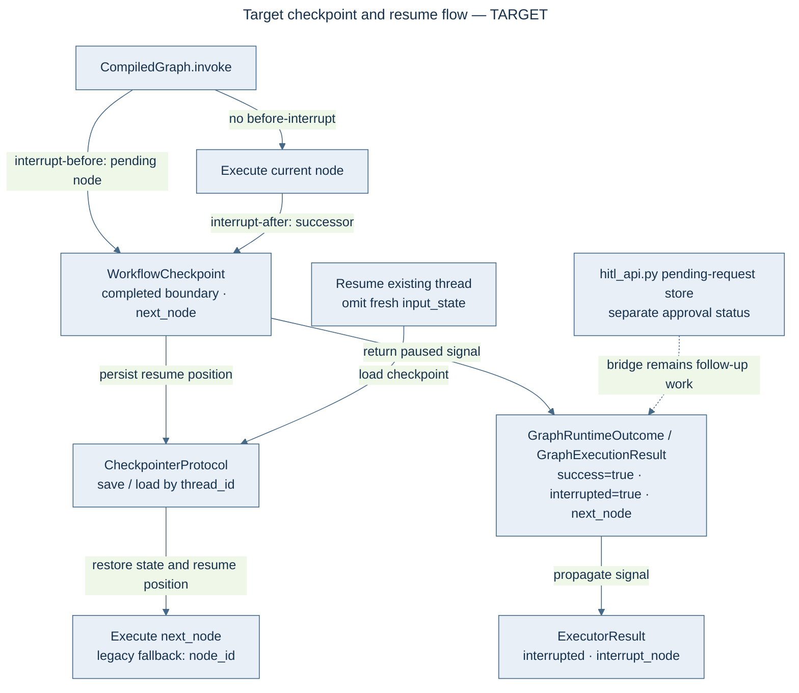

# FEP-0032: Graph Interrupt/Resume Semantics — interrupted signal, resume-at vs completed-at

## Summary

The graph engine's interrupt/resume seam cannot distinguish **paused** from **done**. Both
interrupt paths return `success=True` with no marker: `GraphExecutionResult` and
`GraphRuntimeOutcome` have no `interrupted` field, and `ExecutorResult.interrupted`
(`unified_executor.py:118-119`) has never been assigned by anything. Compounding this, the
interrupt-*after* path saves its checkpoint **after** executing a node, so the checkpoint's
`node_id` is the *completed* node — and resume restarts **at** that node, re-executing an
expensive LLM node that already ran. And `invoke()` with an existing checkpoint silently discards
newly supplied `input_state`. This FEP adds an explicit `interrupted` + `next_node` signal to
results and checkpoints, separates **completed-at** from **resume-at** in the checkpoint model,
turns silent input discard into a loud error, and wires the dormant `ExecutorResult` fields —
reusing `WorkflowCheckpoint`/`CheckpointerProtocol` and mirroring the explicit paused-status
pattern FEP-0028 already ratified and shipped at the team layer.

## Motivation

### The finding (U6-F4, co-design review 2026-09-03)

> "Interrupt/resume broken at the seam: `GraphExecutionResult` has no `interrupted` field (both
> interrupt paths return success=True); `ExecutorResult.interrupted` exists but never set;
> per-node checkpoint stores the *completed* node's id so resume re-executes the last completed
> LLM node; `invoke()` on a thread with a checkpoint silently ignores new `input_state`. HITL
> callers can't distinguish 'paused' from 'done'; crash-resume duplicates an expensive agent
> node; silent input discard is a trap. Add `interrupted`/`next_node` to result and checkpoints;
> separate 'completed-at' from 'resume-at'; error on resume with non-null input_state. FEP
> required (graph semantics)"

The 2026-09-06 verification **narrows the finding in two ways** (both corrections make the fix
smaller than the finding implies):

1. **Interrupt-*before* is not broken.** `graph_runtime.py:199-210` saves the checkpoint for the
   *pending* node before returning, so its resume-at is already correct. Only interrupt-*after*
   (`graph_runtime.py:267-277`, checkpointing at :255 after execution) encodes the completed node.
2. **The U6-F9 shallow-copy-on-resume half is already fixed** — #995 landed a deep copy at
   resume (`graph_execution.py:241-244`, with the aliasing comment). Not planned here.

What remains genuinely broken is the **signal** (no paused marker anywhere in the result or
checkpoint contract) and the **resume-at semantics for interrupt-after** (and crash-during-node,
which shares the completed-at shape).

### Why it matters

- HITL callers cannot distinguish "paused awaiting approval" from "completed" except by
  out-of-band knowledge — `workflows/hitl_api.py` maintains its own pending-request store
  (`StoredRequest.status="pending"`) with no bridge to the execution result, exactly as FEP-0028
  records verbatim (:64).
- A crash mid-LLM-node duplicates a costly agent invocation on resume.
- Passing fresh `input_state` to a thread that has a checkpoint fails silently — the caller
  believes new input was consumed.

## Proposed Change

### Target checkpoint and resume flow

This flow is a **target**; this FEP remains Draft. Existing checkpoint support and ADR-030 sequential-frontier persistence do not provide this general paused-result contract. The HITL request store remains separate; its bridge is follow-up work.

### 1. Explicit paused signal on results

`GraphRuntimeOutcome` (`graph_runtime.py:29`) and `GraphExecutionResult`
(`graph_execution.py:38`) gain `interrupted: bool = False` and `next_node: Optional[str] = None`
(additive dataclass fields with defaults — no caller breakage). Both interrupt paths set them:

- **Interrupt-before**: `interrupted=True`, `next_node=<pending node>`.
- **Interrupt-after**: `interrupted=True`, `next_node=<successor node>`.

`success` stays `True` for an interrupt: paused is not failed, and existing callers that never
interrupt see byte-identical results.

### 2. Resume-at in the checkpoint: separate completed-at from resume-at

`WorkflowCheckpoint` gains an optional `next_node` (serialized in metadata for older
checkpointer backends). Write discipline:

- Interrupt-after saves `{completed_at: current_node, next_node: successor}`.
- Interrupt-before saves `{completed_at: predecessor, next_node: pending node}` (its current
  `node_id` already encodes this — it is migrated into the explicit field).
- Crash recovery saves at the last *completed* boundary, `next_node = the node that was running`.

Resume then continues **from `next_node`** when present, falling back to `node_id` for
pre-existing checkpoints (backward compatible with FEP-0028-era data — see Compatibility).

### 3. Loud input discard

`load_initial_state` (`graph_execution.py:235-244`) currently returns the checkpoint state and
drops `input_state`/`entry_point` silently. Under this FEP, `invoke()` with an existing
checkpoint **and** a non-None `input_state` raises `ValueError` naming the thread and the
offending argument. Supporting "callers who mean resume omit the input" requires two
companion changes, both part of this FEP: `CompiledGraph.invoke()`'s `input_state` becomes
`Optional` (today it is a required positional), and `_validate_input_state` short-circuits on
`None` (today `dict(None)` raises TypeError before any guard would run). `replay_from` keeps
working — it resumes on a fresh `replay_{uuid}` thread with no checkpoint, so it never hits the
guard. The deliberate override path (explicit `input_state` + `start_node` on a checkpointed
thread) is handled by the explicit resume acknowledgement, not silently; its exact ergonomics
are in Unresolved Questions.

### 4. Wire the dormant `ExecutorResult` fields

`unified_executor.py`'s `interrupt_on_hitl` path (config at :247/:283) sets
`ExecutorResult.interrupted`/`interrupt_node` (:118-119, currently never assigned) and propagates
them into the graph-layer result, so the unified executor's HITL flow and the graph engine speak
the same signal.

### FEP-0028 compatibility (the team-layer contract)

FEP-0028 (Accepted; shipped via #733–#752) ratified team-node durability on top of the same
primitives: checkpoints keyed `{thread_id}:{team_node_id}:member:{index}`, structured state with
`completed_member_ids`, resume = re-run on the same thread, skip completed members, **re-run the
paused member**, and an explicit paused shape (`status="awaiting_approval"`, `paused_member_id`).
FEP-0032 is constrained to:

1. **Reuse, don't fork**: `WorkflowCheckpoint`/`CheckpointerProtocol` stay the only storage
   contract; no parallel checkpoint store.
2. **Additive fields only**: teams load the *latest* checkpoint for a thread and encode their own
   resume-at in `node_id`/metadata; adding `next_node` must not disturb latest-checkpoint
   loading or skip-completed/re-run-member semantics (the team node is just a graph node).
3. **Mirror the validated pattern**: the team layer already replaced silent success with an
   explicit paused shape and made re-run-vs-skip per durable unit explicit. The graph layer
   adopts the same shape one level down — `__awaiting_approval__` remains team-internal.

## Implementation Plan

1. **Signal fields** — add `interrupted`/`next_node` to `GraphRuntimeOutcome`,
   `GraphExecutionResult`, `WorkflowCheckpoint` (+metadata serialization); set them on both
   interrupt paths; resume honors `next_node` with `node_id` fallback. Gate: new unit tests for
   both interrupt paths + resume-from-each; existing graph tests byte-green.
2. **Loud input discard** — `input_state` becomes `Optional` on `CompiledGraph.invoke()` with
   `_validate_input_state` short-circuiting on `None`; the `ValueError` guard in `invoke()`;
   `replay_from` regression test. New fields are threaded at the propagation sites:
   `graph.py:427-435` (outcome → result) and the `ExecutorResult(...)` construction in
   `unified_executor.execute` (~:330).
3. **Unified-executor wiring** — `interrupt_on_hitl` sets `ExecutorResult` fields; HITL flow
   test asserting the paused shape surfaces to the caller.
4. **Docs** — `docs/architecture/` note on the checkpoint contract; HITL API's paused-vs-done
   mapping documented against its own request store.

## Benefits

- HITL callers distinguish paused/done/failed from the execution result — no out-of-band store
  consultation for the fundamental question.
- Crash-resume no longer re-executes the last completed LLM node (real cost: agent nodes are the
  most expensive unit in the system).
- Fresh input can no longer be silently swallowed by a stale checkpoint.
- One paused-shape pattern across graph and team layers (FEP-0028 parity), both on the same
  checkpointer.

## Drawbacks and Alternatives

- **New result fields** are a public-contract addition (graph semantics — hence this FEP).
  Additive with defaults; consumers pattern-matching on `success` alone are unaffected.
- **The resume `ValueError`** converts a silent behavior into a loud one — any caller that was
  (wrongly) relying on discard-and-resume will now see the error. That is the point; the error
  message names the remedy.
- **Alternative (rejected): encode paused as `success=False`.** Conflates "paused" with "failed"
  and breaks every `success`-checking caller; the explicit field is cheaper and honest.
- **Alternative (rejected): exception-based interruption signal.** Exceptions as control flow
  across the async graph loop re-opens the GeneratorExit/cancel-scope traceback class FEP-0007
  fought; a data field composes with both buffered and streaming drivers.

## Unresolved Questions

- Should interrupt-after checkpoints also record the *predecessor* (for audit), or is
  completed-at derivable from `next_node` + node history? (Lean: derivable; don't duplicate.)
- The deliberate-override interplay: today a caller can pass `input_state` + `start_node` on a
  checkpointed thread as a valid "restart with new input" override. With the `ValueError` guard,
  that path needs the explicit acknowledgement form — settle whether it is `resume=False`, a
  dedicated `restart()` method, or a separate thread id, during phase 2 review.
- Does `hitl_api.py`'s pending-request store become a view over graph checkpoints in a follow-up,
  or stay independent? (FEP-0028 :64 already notes the missing bridge; out of scope here, but
  this FEP is its prerequisite.)

## Migration Path

Additive and default-off for runs without `InterruptConfig`: they produce identical results.
Interrupt-configured flows change behavior twice, both intentionally: results gain the paused
signal, and resume continues at `next_node` instead of re-executing the completed node. Resume
callers relying on the `node_id` fallback keep working with pre-existing checkpoints (still
re-executing, as today). The new `ValueError` is the only behavior change for non-interrupt
callers, and is exactly the trap the finding names.

## Compatibility

`WorkflowCheckpoint`/`CheckpointerProtocol` unchanged in shape (one optional metadata field).
FEP-0028 team-layer semantics untouched and re-verified by test. `Agent`/SDK surface unaffected
(interrupt/resume is a workflows/HITL feature). Pre-existing checkpoints resume via the
`node_id` fallback.

## Acceptance Criteria

- A run interrupted before a node returns `interrupted=True, next_node=<pending>`; a run
  interrupted after returns `interrupted=True, next_node=<successor>`; neither re-executes a
  completed LLM node on resume.
- `invoke(thread_with_checkpoint, input_state=X)` raises `ValueError`; without `input_state` it
  resumes from `next_node`.
- `ExecutorResult.interrupted` is set by the `interrupt_on_hitl` path (no longer dead).
- FEP-0028 team-layer checkpoint tests pass unchanged.
- U6-F4 marked done in `docs/reviews/2026-09-03-codesign/README.md` with the PR map.

## References

- U6-F4/U6-F9 — `docs/reviews/2026-09-03-codesign/U6-workflows-teams.md`.
- FEP-0028 — team-node durability contract (Accepted; the paused-shape pattern to mirror).
- #995 — deep-copy-at-resume (U6-F9 fix, already landed).
- #1023/#1024 — facade/structural guards (the review's guard-first sequencing, landed).
