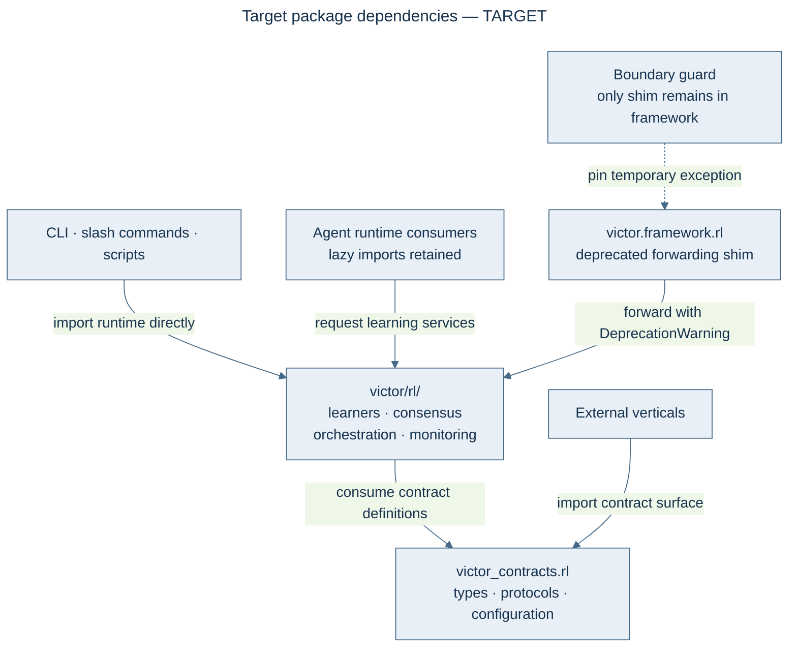

# FEP-0033: RL/Prompt-Evolution Subsystem Relocation

## Summary

`victor/framework/rl/` is a **37,826-line, 79-file application subsystem** (RL credit tracking,
prompt evolution/optimization, GEPA strategy, curriculum, experiments — entry points are the
`/bayesian` `/metrics` `/system` `/prompt_optimize` slash commands, `victor ui` commands, and
`scripts/prompt_candidates.py`) living inside the framework layer whose README contract says it
is "the stable public API." This FEP relocates it to a top-level `victor/rl/` application package
(the `victor/teams/` precedent), promotes the SDK-contract subset into `victor_contracts.rl`,
and leaves a deprecated `__getattr__` shim at `victor.framework.rl` for one deprecation window.
The verified blast radius is far smaller than the backlog's "60-site fan-out" headline: **57
files import the package from outside it (54 non-test production), pulling 19 distinct symbols
at top level (45 including function-level lazy imports)** — and all but two agent-side import
sites are already function-level lazy, so the agent hot path is untouched by the move.

## Motivation

### The finding (U2-F4) and the backlog error

The backlog lists item 29 as "RL/prompt-evolution out of `victor/framework` (FEP-0025 Phase 6)".
Two premises are wrong, verified 2026-09-06:

1. **FEP-0025 has no Phase 6** — its phase table stops at Phase 5 (`victor prompts promote`
   explicitly "not built"). There is nothing to extend; this FEP is the missing architecture
   doc, complementary to FEP-0025's prompt-quality pipeline (which this relocation does not
   change semantically).
2. **The fan-out is overstated.** Verified counts: 161 importing files total (grep), of which
   **104 are test files** — 76 in the subsystem's own test dirs (`tests/unit/framework/rl` ×50,
   `tests/unit/rl` ×26). Non-test production imports: **54 files** (57 including three vertical
   test files), pulling **19 distinct symbols at top level, 45 including function-level lazy
   imports**. Heaviest submodules by direct import fan-in: `rl.coordinator` (18 files),
   `rl.hooks` (14), `rl.base` (12) — `RLOutcome`/`RLRecommendation`/`BaseLearner`,
   `RLCoordinator`/`get_rl_coordinator`, `RLEvent`/`get_rl_hooks`; `rl.migration` and
   `rl.credit_assignment` are heavy by LOC, not fan-in.

### Why it must leave the framework layer

- **Layer honesty.** The framework is "the stable public API" (CLAUDE.md). A self-contained
  learning/experiments subsystem — reachable only from CLI/slash/script entry points, never
  from `Agent`'s public surface — is application code by the repo's own layering definitions.
- **Framework surface tax.** `victor/framework/rl/__init__.py` is 1,001 lines with a 50-name
  `__all__` (62 public top-level names); every framework-surface audit (import-weight guards, API docs, SDK export lists)
  pays for a subsystem most users never enable.
- **Coupling is real but already lazy.** 22 `victor/agent/` files reference rl (orchestrator,
  tool_pipeline, mode_controller, response_quality, context_compactor…), feeding learner
  outcomes into per-turn behavior — but all as function-level lazy imports except two
  (`hybrid_orchestrator.py:26,29`, `services/rl_runtime.py:31`). Relocation therefore does not
  perturb import cost or the hot path; it changes *where the code lives* and *who owns it*.

## Proposed Change

### Target package dependencies

This dependency diagram is a **target**; this FEP remains Draft. Contracts define interfaces and never import the relocated runtime. The existing backwards rl_runtime bridge is retired by the proposal.

### 1. `victor_contracts.rl` becomes the contract home (invert the bridge)

Today `victor_contracts/rl.py` (129 lines) holds only SDK config contracts
(`LearnerType`, `BaseRLConfig`, patience/learner defaults), and `victor_contracts/rl_runtime.py`
(65 lines) is a lazy `__getattr__` bridge pointing **backwards** — contracts →
`victor.framework.rl` — for 13 names (`RLCoordinator`, `RLOutcome`, prompt-rollout helpers,
`get_rl_coordinator*`). This FEP:

- Grows `victor_contracts.rl` to own the cross-boundary contract types among the imported
  symbols (dataclasses/protocols: `RLOutcome`, `RLRecommendation`, event types, config).
- Retires the backwards `rl_runtime` bridge once the real home exists.

### 2. Relocate the subsystem to `victor/rl/`

`victor/framework/rl/**` → `victor/rl/**` (git mv; 4 subpackages move intact:
`learners/`, `consensus/`, `orchestration/`, `monitoring/`). `victor/rl` is an application
package exactly like `victor/teams/` — service-first, entered from commands, not from `Agent`.

### 3. One-window compatibility shim

`victor/framework/rl/__init__.py` shrinks to a module-level `__getattr__` shim: every old name
resolves to the new location with a `DeprecationWarning` (removal in v0.11). The shim keeps every
historically exported name and the test suite import paths working through the migration; no
dual-implementation — the shim only forwards.

### 4. Migrate production callers to the real paths

- The ~57 production importing files move to real `victor.rl.…` paths — including the 16
  `victor/agent/` lazy-import sites,
- Slash/ui command entry points (`/bayesian`, `/metrics`, `/system`, `/prompt_optimize`;
  `ui/commands/{bayesian,benchmark,utils}.py`) → `victor.rl.…`.
- `victor/agent/services/rl_runtime.py` and `hybrid_orchestrator.py` drop their module-level
  imports (the only two module-level agent importers).
- External touchpoints of the prompt-evolution half (`optimization_injector.py`,
  `evolved_content_resolver.py`, `prompt_optimization_reward.py`, `scripts/prompt_candidates.py`)
  move to `victor.rl.learners.*` paths.
- Three vertical test files (`verticals/victor-coding/tests/rl/test_config_framework.py`,
  `verticals/victor-coding/tests/test_coding_vertical_rl.py`,
  `verticals/victor-rag/tests/test_rl_config.py`) import `victor.framework.rl` directly today
  and migrate to `victor_contracts.rl` (the only verticals-legal surface).

### 5. Boundary guard extension

The import-boundary manifest gains: `victor.framework` must not contain `rl` (the shim is the
only allowed residue, pinned by an explicit allowlist entry that a later FEP removes).
Verticals remain on `victor_contracts.rl` only — unchanged discipline.

## Implementation Plan

1. **Contracts first** — grow `victor_contracts.rl` with the contract-type subset; framework rl
   imports them from contracts (dedup, no behavior change). Gate: rl unit tests green.
2. **The move** — `git mv` to `victor/rl/`, fix intra-package imports, leave the framework shim
   forwarding. Gate: full rl test suite green through the shim; streaming/parity batteries
   untouched-green (agent lazy imports still resolve).
3. **Caller migration** — the ~57 production files move to real `victor.rl` paths (mostly
   one-line import edits; tests move with their modules). Gate: grep proves zero non-shim
   `victor.framework.rl` references outside the shim itself.
4. **Shim retirement** — DeprecationWarning shipped in step 2; the shim deletes after one LTS
   window (proposed v0.11; same timeline shape as FEP-0007's alias cleanup).

## Benefits

- The framework layer matches its own contract: no 37.8k-line application subsystem inside the
  stable public API; the 50-name `rl` export surface leaves the framework audit scope.
- A single honest home for RL + prompt-evolution (today split across `framework/rl` +
  `agent/optimization_injector` + `services/prompt_optimization_reward` + scripts).
- The relocation is measurement-preserving: no semantic change to the subsystem (whose judge/
  promotion decisions remain governed by the #884 no-go and FEP-0025).
- Unblocks future RL work (item 31's benchmark-stack integration) on a clean package boundary.

## Drawbacks and Alternatives

- **Import churn.** ~57 production + ~98 test files touch imports; mitigated by the shim
  (nothing breaks during migration) and mechanical one-line edits.
- **`victor.rl` is still inside the `victor` namespace** — verticals could still reach it.
  Mitigated by the manifest discipline (verticals import `victor_contracts.rl` only), unchanged.
- **Alternative (rejected): shrink in place.** Keeping 37.8k lines under `framework/` with a
  slimmer `__init__` treats the symptom (surface) not the cause (wrong layer).
- **Alternative (rejected): move to `victor_contracts`.** Contracts is the definition layer —
  37.8k lines of runtime there would be a worse violation in the opposite direction.

## Unresolved Questions

- Does `services/rl_runtime.py` (the agent-side runtime accessor) belong in `victor/rl/` too,
  or stay as the agent's thin adapter? (Lean: stays — it is agent-side glue, like
  `streaming_act_adapter` is for streaming.)
- Exact contract-type split for `victor_contracts.rl` (which of the imported symbols are
  cross-boundary contracts vs internal mechanics) — settled in step 1 review.

## Migration Path

Three landable PRs mirroring the plan: contracts-dedup → the move+shim → caller migration.
Behavior-neutral throughout: learner outcomes, prompt-promotion flow, and CLI outputs are
byte-identical; the subsystem's test suite (104 importing files) moves with the code in step 2
and is the regression gate.

## Compatibility

`victor.framework.rl` names keep resolving during the deprecation window (shim + warning).
`victor_contracts.rl`/`rl_runtime` consumers (vertical `rl/config.py` files) are unaffected by
step 1 and updated in step 3. No database/schema change; persisted RL state is path-independent.

## Acceptance Criteria

- `victor/framework/rl/` contains only the forwarding shim (or is gone, post-v0.11).
- Zero non-shim `victor.framework.rl` imports in `victor/`, `verticals/`, `scripts/`
  (grep + boundary-guard enforced).
- `victor/rl/` owns the full subsystem; its test suite passes from the new paths.
- `victor_contracts.rl` is the contract home; the backwards `rl_runtime` bridge is retired.
- Backlog item 29 marked done in `docs/reviews/2026-09-03-codesign/README.md` with the PR map.

## References

- U2-F4 — `docs/reviews/2026-09-03-codesign/U2-framework.md`.
- FEP-0025 — prompt-evolution quality pipeline (Draft; phases 3–5 remaining; no Phase 6).
- FEP-0007 (Implemented) — the shim-then-retire deprecation precedent.
- #884 — completion-judge no-go decision (the measured-holding context for this subsystem).
